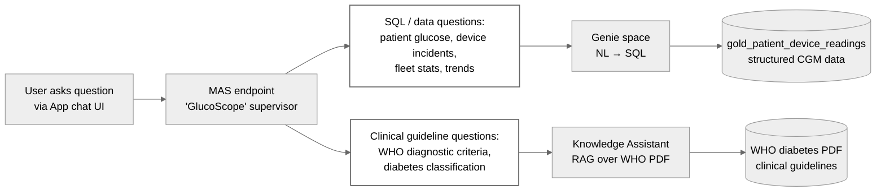
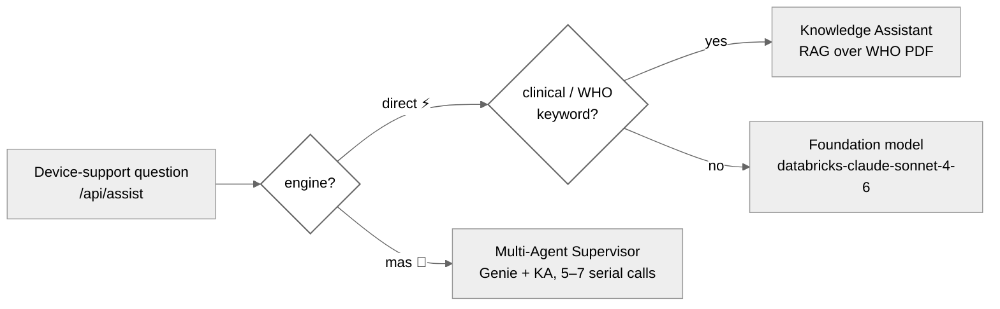

# Glucosphere App

Glucosphere is a CGM (Continuous Glucose Monitoring) Device Intelligence & Analytics Platform built with React and Flask, deployed on Databricks.

## Overview

This application provides:
- **Real-time Device Monitoring**: Track device health, out-of-range events, and anomalies
- **Landing Page Metrics**: Active patients, devices online, high-risk alerts
- **Incident Analysis**: Visualize CGM device calibration incidents and their impact
- **Switchable AI assistant**: a fast app-side router (Genie / Knowledge Assistant / foundation model) with a live ⚡ Fast / 🤖 MAS toggle to the Multi-Agent Supervisor — device troubleshooting + clinical Q&A
- **Heatmap Analytics**: Device performance by model and firmware version

## Architecture

- **Frontend**: React + Vite + Tailwind CSS
- **Backend**: Flask (proxy server for Databricks APIs)
- **Data Source**: Databricks Unity Catalog (`${CATALOG_NAME}.${SCHEMA_NAME}` — set per-deployment via `BUNDLE_VAR_catalog` + `BUNDLE_VAR_schema` in the target's `.env.bundle.<target>` file; see repo-root `.env.bundle.example`)
- **AI assistant**: switchable — a fast app-side **router** (Genie / Knowledge Assistant / foundation model, called directly; default) or the Databricks **Multi-Agent Supervisor** (toggle). See *Assistant engine switch* below.

### Agent endpoints — Genie / KA / MAS (often confused)

The App's natural-language query experience is powered by **Agent Bricks** (Knowledge Assistant + Multi-Agent Supervisor) together with **AI/BI Genie** — a separate Databricks capability that the MAS orchestrates, *not* part of Agent Bricks. The three work together but are NOT interchangeable — each has a distinct data source and purpose:

| Endpoint | Data source | Purpose |
|---|---|---|
| **Genie** | Gold table `<catalog>.<schema>.gold_patient_device_readings` | Natural-language → SQL over **structured CGM data** (patient readings, device incidents, fleet stats, trends) |
| **Knowledge Assistant (KA)** | UC Volume `/Volumes/<catalog>/<schema>/pipeline_data/who_docs/` — WHO diabetes guidelines PDF | **RAG** over WHO **clinical definitions, classification, and diagnosis criteria** |
| **MAS (Multi-Agent Supervisor)** | Routes between the two above based on question type (5–7 serial LLM calls) | Available as the **🤖 MAS** engine toggle. Branded "GlucoScope" in `08_genie_ka_mas.py`. **Not** the default — the app's **default fast router calls Genie / KA / a foundation model directly** (see *Assistant engine switch* below). |

The MAS routing logic (per `Data_DataGen_ModelForecast/08_genie_ka_mas.py:378-384`, "GlucoScope" supervisor instructions):



Examples of the routing in practice:

- *"How many patients had hypoglycemia events last week?"* → MAS routes to **Genie** → SQL over gold table
- *"What's the WHO diagnostic threshold for type-2 diabetes?"* → MAS routes to **KA** → RAG over WHO PDF
- *"Which device firmware has the highest out-of-range rate?"* → MAS routes to **Genie** → SQL aggregation
- *"What does the WHO say about gestational diabetes screening?"* → MAS routes to **KA** → RAG over PDF

### Assistant engine switch — Fast router vs Multi-Agent Supervisor

The Device-support assistant + the per-device "Clinical Analysis" both flow through one
backend route, `POST /api/assist`, with a **switchable engine** (live UI toggle in the
assistant header, ⚡ Fast / 🤖 MAS; persisted in `localStorage`, default from the
`ASSIST_ENGINE` env in `app.yaml`):

| Engine | Path | Latency | Notes |
|---|---|---|---|
| **`direct`** (default, ⚡ Fast) | App-side router → calls **one** specialist directly: keyword-route to **KA** (WHO/clinical terms) else a **foundation model** (`databricks-claude-sonnet-4-6`) for device reasoning; `mode:'analysis'` adds fleet-stats enrichment | ~6–15s, reliable | One decision → one direct call |
| **`mas`** (🤖) | The **Multi-Agent Supervisor** above (Genie + KA) | erratic 17s → >300s under load | Kept for live A/B; preserved/reversible |

**Why the switch exists.** The Agent-Bricks MAS runs 5–7 sequential LLM calls
(supervisor + sub-agents + their FMs); under shared-endpoint contention the per-call queue
delay multiplies and the chain blows past the **~300s Databricks Apps gateway timeout** →
`504 upstream request timeout`. The direct router makes one call (or two for routing), so it
stays fast even under load — matching Databricks' own guidance that deterministic
chains/routers have "typically lower latency (fewer LLM calls for orchestration)." The CGM-data
(Genie) mode is unchanged and always calls Genie directly. Full root-cause analysis:
[`ref_notes/2026-05-31_mas-latency-troubleshooting.md`](../ref_notes/2026-05-31_mas-latency-troubleshooting.md).



## Project Structure

```
App/
├── databricks/          # Flask backend served as a Databricks App (app.py, app.yaml, requirements.txt, static/)
├── src/                 # React frontend source code
│   ├── api/            # API clients (Databricks SQL, Agent, config)
│   ├── components/     # React components
│   └── pages/          # Page components
├── index.html           # Vite entry HTML
├── package.json         # NPM dependencies
├── vite.config.js       # Frontend build configuration (outputs to databricks/static/)
├── tailwind.config.js   # Tailwind config
├── postcss.config.js    # PostCSS (Tailwind) pipeline
└── run_backend.sh       # Local backend startup script
```
The App is deployed as a Databricks Asset Bundle resource (`apps.glucosphere_app`), not via a standalone script — see Deployment below.

## Local Development

### Prerequisites
- Node.js 16+
- Python 3.9+
- Databricks workspace access
- Personal Access Token (PAT)

### Setup

1. **Install dependencies**:
```bash
cd App
npm install
```

2. **Configure environment**:
Create `.env.local` with:
```
DATABRICKS_HOST=https://your-workspace.cloud.databricks.com
DATABRICKS_TOKEN=dapi...your_token_here
VITE_DATABRICKS_TOKEN=dapi...your_token_here
PORT=8000
```

3. **Start backend** (Terminal 1):
```bash
cd App
./run_backend.sh
```

4. **Start frontend** (Terminal 2):
```bash
cd App
npm run dev
```

5. **Access**: http://localhost:5173

## Deployment to Databricks

### Deploy to Databricks Apps

The App ships as a Databricks Asset Bundle resource (`apps.glucosphere_app`, `source_code_path: App/databricks`). Build the frontend, then deploy via the bundle — see [`DEPLOY.md`](../DEPLOY.md) for the full flow:

```bash
cd App && npm run build          # → App/databricks/static/ (served by the Flask app)
cd ..                            # repo root
databricks bundle deploy -t <target>           # pass 1 — creates the warehouse/app
python3 scripts/render_app_yaml.py --target <target> --profile <profile>   # discovers WAREHOUSE_ID/SETUP_JOB_ID/PIPELINE_ID/FORECAST_ENDPOINT_NAME
databricks bundle deploy -t <target>           # pass 2 — picks up the rendered app.yaml
databricks bundle run glucosphere_app -t <target>
```

> **Re-deploying an app/frontend change?** `render_app_yaml.py` must run **before every deploy** — the committed `app.yaml` is a placeholder template that's reverted after each deploy (so the repo never leaks a workspace). It auto-discovers warehouse/job/pipeline by name and reads `catalog`/`schema` (+ the KA/MAS/Genie ids if baked into `.env.bundle.<target>` as `BUNDLE_VAR_mas_endpoint`/`ka_endpoint`/`genie_space_id`) — otherwise pass those three as `--mas-endpoint`/`--ka-endpoint`/`--genie-space-id`. See [`DEPLOY.md`](../DEPLOY.md) → *Re-deploying after a code or frontend change*.

This builds the production frontend, then bundle-deploys the Flask backend + static bundle as the Databricks App. The deployed URL derives from the App name (`${var.app_name}`, default `glucosphere-app`): `https://glucosphere-app-{workspace-id}.databricksapps.com`.

## Key Features

The app's information architecture follows the demo's operational story — **detect →
diagnose → assess → act** — with one surface per move, so navigation mirrors how a fleet
operator would actually work an incident:

| Move | Surface | Question it answers |
|---|---|---|
| **① Detect** | Landing (control tower) · Device Support (firmware × day heatmap) | *Is something wrong, and where?* |
| **② Diagnose** | Firmware Lifecycle | *Which firmware, which direction, how bad?* |
| **③ Assess** | Population Risk | *Who got pushed into danger — what's the blast radius?* |
| **→ Act** | Diabetes Coach (per-patient) · Alert Triage (fleet queue, Lakebase-backed; shown only when the deploy target configures Lakebase) | *Intervene: outreach one patient / work the alert queue* |

New views slot into this spine as their own page rather than growing an existing one —
cross-page deep-links (e.g. Population Risk → "send to triage", Firmware → "flag for
rollback") carry the operator between moves.

### Self-guided tour

First-time visitors get an offer to take a **built-in guided tour** (no external library —
`App/src/components/GuidedTour.jsx` + `App/src/tour/steps.js`); it's relaunchable anytime
from the nav rail. Two variants from the chooser:

- **Quick overview** — the Detect → Diagnose → Assess (→ Act) story in ~9 spotlight steps.
- **Interactive walkthrough** — every panel, with **"⏸ Try it yourself — I'll wait here"**
  pauses on hands-on steps: the overlay steps aside so the page is fully clickable and an
  amber **▶ Resume tour** pill stays on screen to return to the same step. It also opens
  and drives the assistant (Genie tab, Fast ⇄ MAS engine switch) mid-tour.

Both variants end on **The Full Loop** page (`/full-loop`) and adapt to the deploy target:
the Alert-Triage stops appear only when Lakebase is configured (step counts adjust). Each
card carries a **step scrubber slider** — drag to jump to any step; clicking outside the
card never ends the tour (Skip/Done are the explicit exits).

### Landing Page
- **Active Patients**: Real-time count from gold table
- **Devices Online**: Devices with recent readings
- **High-Risk Alerts**: Out-of-range glucose readings
- **Recent Incident Analysis**: 7-day calibration incident visualization

### Device Support Dashboard
- **Heatmap**: Out-of-range events by device type and firmware
- **Device Details**: Expandable table with device information
- **Pattern Alerts**: Emerging anomalies across device cohorts
- **AI Troubleshooting**: switchable assistant (fast router by default; Multi-Agent Supervisor on toggle) for device analysis

### Firmware Lifecycle
- **MAE timeline**: per-model device error (mean |observed − true|) across the baseline → transient-fault → fix sequence, scoped to the in-incident window so a ~12-hour fault isn't diluted by a whole-day average
- **Calibration drift panel**: per-firmware over-/under-read direction and magnitude, with a deep-link to the affected cohort on Population Risk

### Population Risk
- **Cohort exposure → fault classification**: each cohort's device-reported %hypo/%hyper bars sit above an aligned 3×3 confusion matrix (Under-read · Baseline-control · Over-read), normalizable by share-of-all (default) or per-true-band — separating what the device *reported* from what was *truly* happening during the fault window
- **Affected-patient roster**: the worst-N firmware-recall-cohort patients ranked by clinical burden (filterable by region / device model), each deep-linking to the Diabetes Coach

### Alert Triage (Lakebase — flag-gated)
- **Live alert queue** (`/triage`): the affected cohort as actionable alerts — **acknowledge / assign /
  resolve** (resolution-outcome menu incl. "not a device issue" and EMS escalation), free-text **notes**,
  **fingerstick follow-up** requests, and **bulk actions** over the filtered set (e.g. one "firmware rolled
  back" resolves a whole cohort) — every action appends an **audit row** (the recall's compliance trail)
- **Scenario vantages**: full week / Day-2 rollout / Day-5 hotfix fault / **last-3h live-risk view**
  (readings-only detection — no incident labels, the production-realistic path)
- Backed by **Lakebase** (managed Postgres, Autoscaling): the dashboards read the lakehouse; the queue is
  the app's **transactional write path**. Enabled per deploy target via the `lakebase_project_id` bundle
  variable (see `DEPLOY.md`); targets without it render the pre-Lakebase UI unchanged

**Operational notes (Lakebase):**
- **Division of labor** — the **Lakebase project is created once, outside the bundle** (one CLI command;
  see `DEPLOY.md` — keeping a stateful DB out of `bundle destroy`'s blast radius avoids both data loss
  and the soft-delete id-tombstone that blocks a same-id redeploy); the **Asset Bundle wires the app to
  it by name** (the app's `postgres` resource binding, which auto-creates the app service principal's PG
  role and injects `PGHOST`/`PGUSER`/`PGDATABASE`); the **app bootstraps its own schema at runtime**
  (`App/databricks/lakebase.py`, idempotent on first DB touch). The schema can't move to deploy time:
  its objects must be **owned by the app SP's role**, an identity only the app runs as.
- **Tables live in the app-owned `triage` schema** (`triage.alerts`, `triage.alert_audit`) — not `public`
  (PG 15+ denies CREATE there). The bootstrap GRANTs **read/write** (`SELECT/INSERT/UPDATE/DELETE/
  TRUNCATE` + sequence usage) to other database roles — `PUBLIC` here reaches only the roles provisioned
  on this Lakebase project (the operator + app SPs). Deliberately wider than read-only: every app
  recreate **rotates the app SP**, and the rotated SP doesn't own objects its predecessor created —
  read-only grants left a rebuilt app with `permission denied for schema triage`. Demo-grade posture
  (alert rows are disposable demo state).
- **Auth**: no password is stored or injected — the app mints short-lived OAuth tokens
  (`POST /api/2.0/postgres/credentials`) as the PG password, refreshed ~50 min.
- The Lakebase **Data API does not need enabling** — the app speaks the native Postgres wire protocol
  (`psycopg`).
- **Drift warning**: `bundle deploy` does **not** recreate an externally-deleted project (the deployment
  state isn't refreshed against the workspace). Lakebase deletion is soft — restore with
  `POST /api/2.0/postgres/projects/<project-id>/undelete` (settings, roles, and storage survive), then
  restart the app. Failure signature while the project is gone: queue actions return
  `404 …/postgres/credentials`. `scripts/smoke_test.py` check 9 catches both this and any
  app↔schema permission break (it probes `/api/alerts` end-to-end).

### Assistant (fast router · MAS toggle)
- Chat interface for device troubleshooting (`/api/assist`)
- Deeper per-device Clinical Analysis (fast FM + fleet-stats enrichment by default)
- Integration with CGM analytics (Genie) and clinical knowledge (KA) — called directly by the router, or via the MAS supervisor when toggled. See *Assistant engine switch* above.

## Data Schema

Primary table: `${CATALOG_NAME}.${SCHEMA_NAME}.gold_patient_device_readings` (e.g. `<your-catalog>.<your-schema>.gold_patient_device_readings`).

The React app fetches catalog/schema from the Flask `GET /api/config` endpoint at startup (helper in `App/src/api/config.js`), then constructs queries via template literals `${catalog}.${schema}.<table>`. CATALOG_NAME + SCHEMA_NAME are sourced from `App/databricks/app.yaml` env vars per target — no inline hardcoding anywhere in `App/src/`.

Key columns:
- `device_id`, `patient_id`, `time`
- `glucose`, `glucose_out_of_range`
- `device_model`, `firmware_version`
- `region`, `patient_diagnosis`

Incident table: `${CATALOG_NAME}.${SCHEMA_NAME}.pseudo_incident_7d_labeled`

## Configuration

- **`databricks/app.yaml`** — Databricks App deployment config (env vars + resource bindings; regenerated per-target via `scripts/render_app_yaml.py`).

### About page — "Under the hood" platform deep-links

The About page renders a Data → ML/AI → Agentic platform panel whose nodes deep-link into the
**deploying** workspace. Every link is built client-side from `GET /api/config` (no tenant
hardcoded in the bundle), so they resolve in whatever workspace the app is deployed to — as long
as the underlying value is set. There are two classes, and it matters for a fresh-workspace deploy:

| About link | `/api/config` field ← env var | How it resolves on deploy |
| --- | --- | --- |
| Unity Catalog | `workspace_host` + `catalog` + `schema` | **Auto** — host from the Apps runtime (`DATABRICKS_HOST`); catalog/schema from bundle vars |
| MLflow | `workspace_host` → `/ml/experiments` | **Auto** — workspace-relative, no id needed |
| DLT pipeline | `pipeline_url` ← `PIPELINE_ID` | **Auto** — `render_app_yaml.py` discovers it by name `glucosphere-cgm-silver-gold-<target>` |
| Model Serving (forecast) | `forecast_endpoint_url` ← `FORECAST_ENDPOINT_NAME` | **Auto** — discovers `Glucosphere_Forecast_15min<harness_suffix>` |
| Jobs (orchestration) | `setup_job_url` ← `SETUP_JOB_ID` | **Auto** — discovers `glucosphere-full-setup-<target>` |
| Genie | `genie_space_id` ← `GENIE_SPACE_ID` | **Operator-set** — pass `render_app_yaml.py --genie-space-id …` |
| Knowledge Assistant | `ka_endpoint_url` ← `KA_ENDPOINT_NAME` | **Operator-set** — pass `--ka-endpoint …` |
| Multi-Agent Supervisor | `mas_endpoint_url` ← `ENDPOINT_NAME` | **Operator-set** — pass `--mas-endpoint …` |

- **Auto** links need no manual input — `scripts/render_app_yaml.py` looks each id up by its
  deterministic resource name at deploy time (the same mechanism used for `WAREHOUSE_ID`). If an
  id can't be found yet (e.g. first-pass render before `bundle deploy`), the value is left empty
  and the link **falls back to the workspace listing** (`/pipelines`, `/ml/endpoints`, `/jobs`),
  so nothing 404s.
- **Operator-set** links (Genie / KA / MAS) can't be auto-discovered — the KA/MAS Agent Bricks
  endpoints get a random suffix per workspace, and each Genie space has its own workspace-specific
  id. They're set on the second render pass via the flags above. This is
  **the same config the chat assistant already requires** (`/api/assist` routes to `ENDPOINT_NAME`
  / `KA_ENDPOINT_NAME`; Genie uses `GENIE_SPACE_ID`), so if the assistant works on a fresh deploy,
  these deep-links work too — the panel adds no new portability burden.
- **Access:** every link opens the Databricks workspace and is OAuth-gated — a signed-in user with
  object access clicks straight through; without it they hit sign-in / 403. The inline one-liner on
  each node keeps the panel readable without workspace access. To grant the demo audience that object
  access in one shot — `CAN_USE` on the app itself plus view-level access across all of these
  deep-link targets — run `scripts/grant_viewers.py` (see DEPLOY.md "Grant the audience"). The app's
  *own* data access is separate: it renders through its service principal, entitled by
  `scripts/grant_app_sp.py`.

```bash
# Audience: CAN_USE on the app + view access to every deep-link target (dry-run by default; --apply to grant).
# --principal is a user (user@example.com), group, or service-principal app-id (type auto-detected).
uv run python scripts/grant_viewers.py --principal <user|group|sp-app-id> \
    --target <target> --catalog <catalog> --schema <schema> --profile <profile> --apply
```

See `scripts/render_app_yaml.py` (the `discover_*` helpers) for the by-name lookups, and
`App/databricks/app.py` `GET /api/config` for how each field is assembled.

## Dependencies & licenses

Full dependency + license inventory — frontend (`package.json`), backend
(`requirements.txt`, incl. the **LGPL-3.0 psycopg** driver for Lakebase), and the
platform services consumed at runtime — lives in [`DEPENDENCIES.md`](DEPENDENCIES.md).


## License + support

This project is provided AS-IS under the included [`LICENSE.md`](../LICENSE.md) at the repo root, with no warranty or support obligation. For bug reports or feature suggestions, file a [GitHub Issue](https://github.com/databricks-industry-solutions/glucosphere/issues) on the repo.
