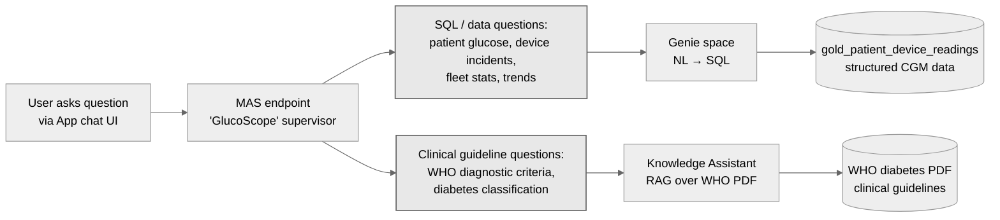

# Glucosphere App

Glucosphere is a CGM (Continuous Glucose Monitoring) Device Intelligence & Analytics Platform built with React and Flask, deployed on Databricks.

## Overview

This application provides:
- **Real-time Device Monitoring**: Track device health, out-of-range events, and anomalies
- **Landing Page Metrics**: Active patients, devices online, high-risk alerts
- **Incident Analysis**: Visualize CGM device calibration incidents and their impact
- **Multi-Agent Supervisor**: AI-powered device troubleshooting and analysis
- **Heatmap Analytics**: Device performance by model and firmware version

## Architecture

- **Frontend**: React + Vite + Tailwind CSS
- **Backend**: Flask (proxy server for Databricks APIs)
- **Data Source**: Databricks Unity Catalog (`${CATALOG_NAME}.${SCHEMA_NAME}` — set per-deployment via `BUNDLE_VAR_catalog` + `BUNDLE_VAR_schema` in `.env.bundle`; see repo-root `.env.bundle.example`)
- **AI Agent**: Databricks Multi-Agent Supervisor

### Agent endpoints — Genie / KA / MAS (often confused)

The App's natural-language query experience is powered by **three native Databricks Agent Bricks endpoints** that work together. They are NOT interchangeable — each has a distinct data source and purpose:

| Endpoint | Data source | Purpose |
|---|---|---|
| **Genie** | Gold table `<catalog>.<schema>.gold_patient_device_readings` | Natural-language → SQL over **structured CGM data** (patient readings, device incidents, fleet stats, trends) |
| **Knowledge Assistant (KA)** | UC Volume `/Volumes/<catalog>/<schema>/pipeline_data/who_docs/` — WHO diabetes guidelines PDF | **RAG** over WHO **clinical definitions, classification, and diagnosis criteria** |
| **MAS (Multi-Agent Supervisor)** | Routes between the two above based on question type | The endpoint the App's chat UI actually calls — operator never invokes Genie or KA directly. Branded as "GlucoScope" in `08_genie_ka_mas.py` |

The MAS routing logic (per `Data_DataGen_ModelForecast/08_genie_ka_mas.py:325-331`, "GlucoScope" supervisor instructions):



Examples of the routing in practice:

- *"How many patients had hypoglycemia events last week?"* → MAS routes to **Genie** → SQL over gold table
- *"What's the WHO diagnostic threshold for type-2 diabetes?"* → MAS routes to **KA** → RAG over WHO PDF
- *"Which device firmware has the highest out-of-range rate?"* → MAS routes to **Genie** → SQL aggregation
- *"What does the WHO say about gestational diabetes screening?"* → MAS routes to **KA** → RAG over PDF

## Project Structure

```
App/
├── config/               # Databricks workspace configurations
├── databricks/          # Flask backend (app.py, app.yaml, requirements.txt)
├── docs/                # Documentation and technical notes
├── scripts/             # Deployment scripts
├── src/                 # React frontend source code
│   ├── api/            # API clients (Databricks SQL, Agent)
│   ├── components/     # React components
│   └── pages/          # Page components
├── deploy_glucosphere.py # Deployment script for Databricks Apps
├── package.json         # NPM dependencies
├── vite.config.js       # Frontend build configuration
└── run_backend.sh       # Local backend startup script
```

## Local Development

### Prerequisites
- Node.js 16+
- Python 3.9+
- Databricks workspace access
- Personal Access Token (PAT)

### Setup

1. **Install dependencies**:
```bash
cd App
npm install
```

2. **Configure environment**:
Create `.env.local` with:
```
DATABRICKS_HOST=https://your-workspace.cloud.databricks.com
DATABRICKS_TOKEN=dapi...your_token_here
VITE_DATABRICKS_TOKEN=dapi...your_token_here
PORT=8000
```

3. **Start backend** (Terminal 1):
```bash
cd App
./run_backend.sh
```

4. **Start frontend** (Terminal 2):
```bash
cd App
npm run dev
```

5. **Access**: http://localhost:5173

## Deployment to Databricks

### Deploy to Databricks Apps

```bash
cd App
npm run build
python3 deploy_glucosphere.py
```

This will:
- Build the production frontend
- Upload all files to Databricks workspace
- Create/update the Databricks App
- Deploy to: `https://glucosphere-{workspace-id}.databricksapps.com`

## Key Features

### Landing Page
- **Active Patients**: Real-time count from gold table
- **Devices Online**: Devices with recent readings
- **High-Risk Alerts**: Out-of-range glucose readings
- **Recent Incident Analysis**: 7-day calibration incident visualization

### Device Support Dashboard
- **Heatmap**: Out-of-range events by device type and firmware
- **Device Details**: Expandable table with device information
- **Pattern Alerts**: Emerging anomalies across device cohorts
- **AI Troubleshooting**: Multi-agent supervisor for device analysis

### Multi-Agent Supervisor
- Chat interface for device troubleshooting
- Deeper analysis for specific devices
- Integration with CGM analytics and clinical knowledge

## Data Schema

Primary table: `${CATALOG_NAME}.${SCHEMA_NAME}.gold_patient_device_readings` (e.g. `<your-catalog>.<your-schema>.gold_patient_device_readings`).

The React app fetches catalog/schema from the Flask `GET /api/config` endpoint at startup (helper in `App/src/api/config.js`), then constructs queries via template literals `${catalog}.${schema}.<table>`. CATALOG_NAME + SCHEMA_NAME are sourced from `App/databricks/app.yaml` env vars per target — no inline hardcoding anywhere in `App/src/`.

Key columns:
- `device_id`, `patient_id`, `time`
- `glucose`, `glucose_out_of_range`
- `device_model`, `firmware_version`
- `region`, `diabetes_type`

Incident table: `${CATALOG_NAME}.${SCHEMA_NAME}.pseudo_incident_7d_labeled`

## Configuration

- **`databricks/app.yaml`** — Databricks App deployment config (env vars + resource bindings; regenerated per-target via `scripts/render_app_yaml.py`).

## Dependencies used and their corresponding license information

### Frontend (`package.json`)

| Dependency | Where used | Why it's used | License |
| --- | --- | --- | --- |
| [**react**](https://github.com/facebook/react) | `App/src/*.jsx` | UI framework | MIT |
| [**react-dom**](https://github.com/facebook/react) | `App/src/main.jsx` | React renderer for browser DOM | MIT |
| [**react-router-dom**](https://github.com/remix-run/react-router) | `App/src/App.jsx`, `App/src/pages/*` | Client-side routing | MIT |
| [**lucide-react**](https://github.com/lucide-icons/lucide) | Icons across pages | Icon set | ISC |
| [**react-markdown**](https://github.com/remarkjs/react-markdown) | MetricsExplained + MAS reply rendering | Markdown → React component | MIT |
| [**vite**](https://github.com/vitejs/vite) | Build tool (`npm run build`) | Frontend bundler | MIT |
| [**@vitejs/plugin-react**](https://github.com/vitejs/vite-plugin-react) | `vite.config.js` | React fast-refresh + JSX support | MIT |
| [**tailwindcss**](https://github.com/tailwindlabs/tailwindcss) | `tailwind.config.js` + all components | Utility-first CSS | MIT |
| [**postcss**](https://github.com/postcss/postcss) | `postcss.config.js` | CSS transform pipeline (Tailwind processor) | MIT |
| [**autoprefixer**](https://github.com/postcss/autoprefixer) | `postcss.config.js` | Vendor-prefix automation | MIT |

### Backend (`App/databricks/requirements.txt`)

| Dependency | Where used | Why it's used | License |
| --- | --- | --- | --- |
| [**flask**](https://github.com/pallets/flask) | `App/databricks/app.py` | HTTP server framework (routes for `/api/sql/query`, `/api/config`, `/uc-assets/`, `/api/clinician-summary`) | BSD-3-Clause |
| [**requests**](https://github.com/psf/requests) | `App/databricks/app.py` | Outbound HTTP to Databricks Statement Execution API, KA/MAS serving endpoints, UC Files API | Apache-2.0 |

**Note on package URLs.** GitHub source repos linked on names above. If your Databricks workspace or corporate network blocks direct PyPI / npm egress, see the [note on package URLs and network reachability](../Data_DataGen_ModelForecast/README.md#note-on-package-urls-and-network-reachability) under the Data_DataGen dep table for context and Databricks egress-policy pointers.

Python runtime is provided by the Databricks Apps platform — no local Python pin in `App/`. (Repo-root `scripts/` use Python 3.11 via `uv`; see [`DEPLOY.md`](../DEPLOY.md).)

### Platform services (consumed at runtime, not bundled deps)

| Service | Where used | Why it's used |
| --- | --- | --- |
| **Databricks Statement Execution API** | `App/databricks/app.py` `/api/sql/query` | Routes SQL queries to the bundle-managed serverless warehouse |
| **Multi-Agent Supervisor (MAS) serving endpoint** | `App/databricks/app.py` `/api/clinician-summary` | Clinical reasoning queries |
| **Knowledge Assistant (KA) serving endpoint** | Routed through MAS | RAG over WHO clinical-guidelines PDF |
| **Genie space** | Routed through MAS | NL-to-SQL over gold device tables |
| **Databricks Apps Platform** | Deployment target | Hosts Flask + React static build |

## License + support

This project is provided AS-IS under the included [`LICENSE.md`](../LICENSE.md) at the repo root, with no warranty or support obligation. For bug reports or feature suggestions, file a [GitHub Issue](https://github.com/databricks-industry-solutions/glucosphere/issues) on the repo.
