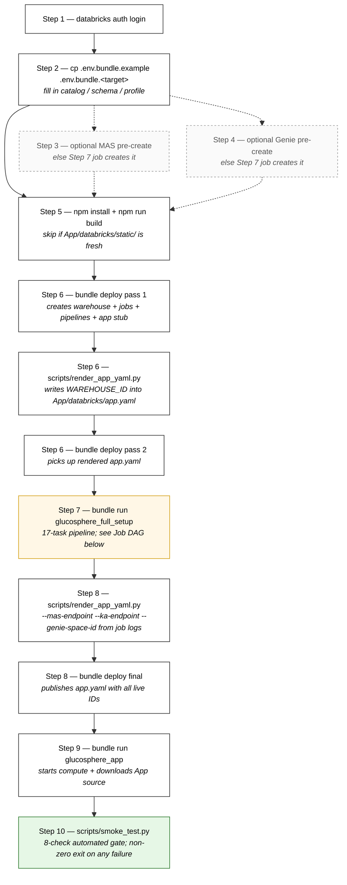
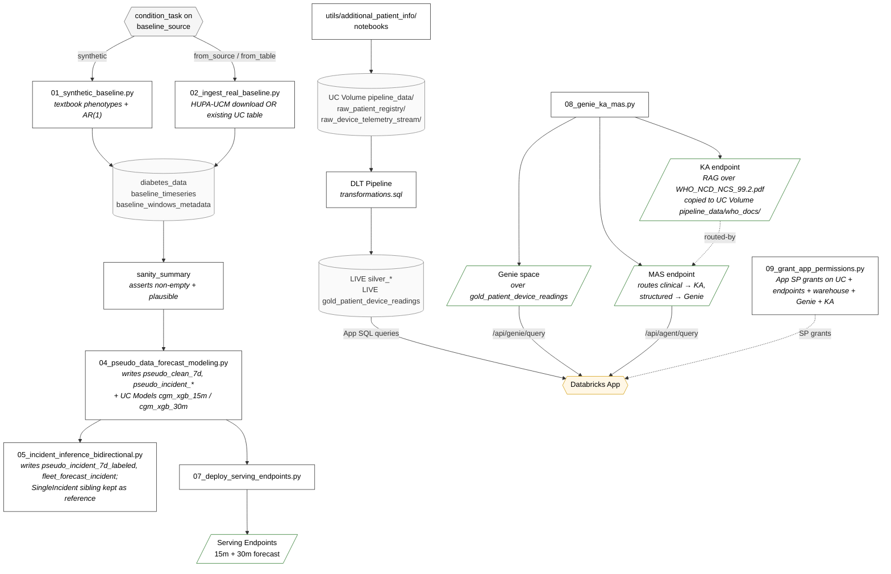
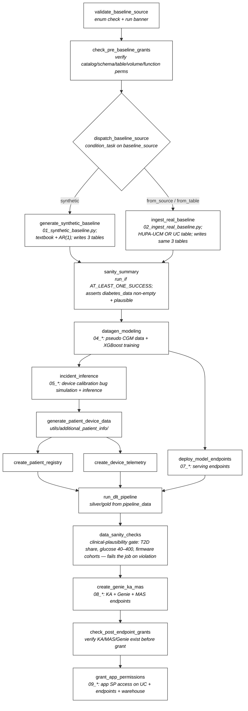

# Glucosphere Deployment Guide

This guide walks through deploying the full Glucosphere stack — data pipelines, ML models, and the dashboard app — to any Databricks workspace using the Databricks Asset Bundle (DAB). It is the **canonical deployment doc** for this repo.

> **New to the repo?** Read [`REPO_LAYOUT.md`](REPO_LAYOUT.md) first for a navigation guide: which files do what, the full workflow DAG, what's PR-shipped vs internal-refs.

## Deploy flow at a glance

The full first-deploy sequence (operator-driven; each box is a single CLI command run locally). Total wall clock ~51 min on a fresh workspace; subsequent redeploys reuse KA/MAS/Genie + model endpoints and run ~48 min. Steps 3 + 4 (MAS / Genie pre-create) are **optional** — the Step 7 setup job creates them if absent.



The Step 7 pipeline job is itself a 17-task DAG — see [Step 7 § Job DAG](#step-7-run-the-setup-job) below.

> **If you're an agent following this guide:** do not skip steps and do not
> assume prior workspace state. Verify each step's output before moving on,
> and capture the KA/MAS/Genie IDs from the Step 7 job logs — they're needed for Step 8.

## Prerequisites

- [Databricks CLI v0.281.0+](https://docs.databricks.com/dev-tools/cli/install.html) installed (v0.281.0 added DAB dashboard support; earlier versions still work for jobs/pipelines/apps)
- Node.js 18+ (for the React frontend build, Step 5)
- [uv](https://docs.astral.sh/uv/) installed (manages the local Python env for `scripts/render_app_yaml.py`). Run `uv sync` from the repo root once — it reads `pyproject.toml` + `.python-version` and creates `.venv` pinned to Python 3.11. After that, prefix Python commands with `uv run` (e.g. `uv run python scripts/render_app_yaml.py …`) — no manual activation needed.
- Unity Catalog enabled on the target workspace
- `CREATE CATALOG` privilege (or a pre-existing catalog you own)
- Model serving enabled on the workspace
- (Optional) Pre-created MAS / Genie endpoints — only needed if you want to override the names the Step 7 setup job would otherwise create. See Steps 3 + 4.

---

## Architecture Overview

The pipeline branches early on the `baseline_source` bundle variable
(`synthetic` vs `from_source` vs `from_table`); a `condition_task`
in `databricks.yml` dispatches to the right ingest notebook. Both branches
converge on `diabetes_data` and the downstream modeling spine is shared.



---

## Step 1: Authenticate

```bash
databricks auth login --host https://<your-workspace>.azuredatabricks.net
```

Or set environment variables:
```bash
export DATABRICKS_HOST=https://<your-workspace>.azuredatabricks.net
export DATABRICKS_TOKEN=<your-token>
```

---

## Step 2: Configure Variables via `.env.bundle.<target>`

Per-operator workspace-specific values live in a **per-target** config file,
`.env.bundle.<target-key>` (all gitignored). Keep **one file per deploy target**
— named for the `databricks.yml` target key — so a `source` always carries that
target's complete coords. There is no shared mutable file and no `HARNESS_TYPE`
conditional, so you can never "source the wrong one last" and silently deploy a
target with another target's catalog/schema (the root cause of past
wrong-schema / SQL-403 drift).

```bash
# Make one file per target you deploy (gitignored). Name = the databricks.yml target key.
cp .env.bundle.example .env.bundle.gsphere      # live target
# edit .env.bundle.gsphere and fill in (note: `export` is REQUIRED — without it the
# variables stay shell-local and the databricks CLI subprocess does not see them):
#   export BUNDLE_VAR_catalog=<your-catalog>
#   export BUNDLE_VAR_schema=<your-schema>
#   export DATABRICKS_CONFIG_PROFILE=<your-profile>

# Deploy with name parity — source the file that matches the target:
#   source .env.bundle.gsphere && databricks bundle deploy -t gsphere
```

A harness/sandbox target gets its own file (e.g. `.env.bundle.gsphere_from_source_e2e`)
with its own isolated `BUNDLE_VAR_schema` and a non-empty `BUNDLE_VAR_harness_suffix`.

Top-level bundle variables (defined in `databricks.yml`):

| Variable | Where set | Default | Notes |
|---|---|---|---|
| `catalog` | `.env.bundle.<target>` (`BUNDLE_VAR_catalog`) | `glucosphere_catalog` (placeholder) | Operator's UC catalog |
| `schema` | `.env.bundle.<target>` (`BUNDLE_VAR_schema`) | `glucosphere_schema` (placeholder) | UC schema (set the full schema explicitly per target) |
| `baseline_source` | `.env.bundle.<target>` (optional) | `from_source` | `synthetic` / `from_source` / `from_table` |
| `source_catalog` / `source_schema` / `source_table` | `.env.bundle.<target>` (optional) | `""` | Used by `from_table` mode; empty triggers auto-detect |
| `app_name` | `.env.bundle.<target>` (optional) | `glucosphere-app` | Databricks App display name |
| `dev_initials` | `.env.bundle.<target>` (optional) | `user` | Harness target suffix for collision avoidance when sharing a workspace; ≤7 chars |
| `app_basename` | `.env.bundle.<target>` (optional) | `glucosphere` | Harness base name (shorten to fit the 30-char App limit if needed) |
| `harness_suffix` | `.env.bundle.<target>` (`BUNDLE_VAR_harness_suffix`) or `--var` at deploy | `""` (live) | Suffix appended to workspace-global resource **names** — the Genie space / Knowledge Assistant / Multi-Agent Supervisor (`08_genie_ka_mas.py`) **and** the two forecast serving endpoints. `08` looks these up by name and **reuses** them if found, so empty → reuse the shared live agents, non-empty → create **new, separate** ones. Does **not** change the schema/data (that's `schema`). See [Creating new / separate agent resources](#creating-new--separate-agent-resources-genie--ka--mas). |

`warehouse_id` is **not** a bundle variable. The bundle declares a
`sql_warehouses.glucosphere_warehouse` resource that creates the warehouse
on first deploy. `scripts/render_app_yaml.py` discovers it by deterministic
name and writes `WAREHOUSE_ID` into `App/databricks/app.yaml`.

> **Assistant engine.** The Device-support assistant calls `/api/assist` with a switchable
> engine — `ASSIST_ENGINE=direct` (default; a fast router → Genie / Knowledge Assistant /
> foundation model `FM_ENDPOINT`) or `mas` (the Multi-Agent Supervisor). The app SP needs
> `CAN_QUERY` on the FM endpoint too; `scripts/grant_app_sp.py` auto-discovers it from
> `app.yaml`. Rationale + the latency root-cause: [`App/README.md`](App/README.md). Standalone
> apps need the SP grant after `apps create` (see `scripts/grant_app_sp.py --help`).

> **Deploying to a different workspace**: you do NOT need to edit
> `databricks.yml`. The committed target stanzas have no hardcoded
> `workspace.host` — DABs uses the host from the profile selected by
> `DATABRICKS_CONFIG_PROFILE` in your `.env.bundle.<target>`. Set up a profile
> via `databricks configure --profile <name>` for your workspace, point that
> target's file at it, and run `source .env.bundle.<target> && bundle deploy -t <target>`.

---

## Step 3: (Optional) Pre-create the Multi-Agent Supervisor Endpoint

> **Skip unless you have a reason to override the default.** The Step 7 setup job (`08_genie_ka_mas.py`) creates the MAS endpoint if it doesn't already exist, and reuses it by name if it does. Pre-create only if you want to control the endpoint name, point at a pre-built MAS configuration, or stage the endpoint ahead of running the long setup job.

1. In your target workspace, open **Serving → Create serving endpoint**
2. Deploy the MAS configuration from your agent framework
3. Note the endpoint name (e.g. `glucosphere-mas-endpoint`)
4. Reference it during Step 8 re-render: `--mas-endpoint <name>`

---

## Step 4: (Optional) Pre-create the Genie Room

> **Skip unless you have a reason to override the default.** The Step 7 setup job (`08_genie_ka_mas.py`) provisions a Genie space over `gold_patient_device_readings` if one isn't already wired up. Pre-create only if you want to author CGM-specific instructions yourself or reuse an existing room.

1. In your target workspace, open **Genie → New room**
2. Add `{catalog}.{schema}.gold_patient_device_readings` as a data source
3. Configure the room with CGM-specific instructions
4. From the room URL, copy the room ID (the hex string after `/genie/rooms/`)
5. Reference it during Step 8 re-render: `--genie-space-id <room-id>`

---

## Step 5: Build the React Frontend

```bash
cd App
npm install
npm run build
# This produces App/databricks/static/ which the Flask app serves
```

---

## Step 6: Deploy the Bundle (two-pass on first deploy)

On a fresh workspace the first deploy creates the bundle-managed
`sql_warehouses.glucosphere_warehouse` resource. `render_app_yaml.py` then
discovers it by name and writes `WAREHOUSE_ID` into `App/databricks/app.yaml`.
The second deploy syncs the updated app.yaml to the workspace.

```bash
# Make sure .env.bundle.<target> is filled in (see Step 2), then:
source .env.bundle.<target>
databricks bundle deploy -t <target>            # Pass 1: creates warehouse + apps + jobs
uv run python scripts/render_app_yaml.py --target <target>    # Discover warehouse + rewrite app.yaml
databricks bundle deploy -t <target>            # Pass 2: sync updated app.yaml
```

Subsequent deploys are single-pass (warehouse already exists; render still
useful when catalog/schema/etc. change in `.env.bundle.<target>`).

`-t <target>` is always required — no `default: true` target exists.

---

## Step 7: Run the Setup Job

```bash
databricks bundle run glucosphere_full_setup -t <target>
```

This runs the end-to-end pipeline below.

### Job DAG



The validate + sanity tasks (added in C.5) are fail-fast guards: they catch
operator typos and silent baseline-write failures before they cost ~45 min
of downstream modeling compute.

> **Note:** The `generate_patient_device_data` task references the Jupyter notebooks in `Data_DataGen_ModelForecast/utils/additional_patient_info/`. If those notebooks need to be converted to Databricks-native format before running, do so with:
> ```bash
> databricks workspace import --format JUPYTER <notebook.ipynb> <workspace-path>
> ```

---

## Step 8: Re-render App Environment Variables with Real KA/MAS/Genie IDs

The Step 7 setup job ran `08_genie_ka_mas.py` which created (or reused) the KA, MAS, and Genie space. Capture their IDs from the job logs, then re-run `render_app_yaml.py` with the override flags to bake them into `App/databricks/app.yaml`, then redeploy:

```bash
source .env.bundle.<target>
uv run python scripts/render_app_yaml.py \
    --target <target> \
    --profile <profile> \
    --mas-endpoint   <mas-endpoint-name> \
    --ka-endpoint    <ka-endpoint-name> \
    --genie-space-id <genie-space-id>
databricks bundle deploy -t <target> --profile <profile>
```

On subsequent runs against the same workspace, `08_genie_ka_mas.py` reuses the existing KA/MAS/Genie by name, so the IDs in `app.yaml` stay valid — Step 8 is only required on the first deploy to a fresh workspace.

---

## Step 9: Deploy and Start the App

**Required.** Apps have an independent lifecycle from Jobs in DABs — the setup job in Step 7 does NOT deploy the App's source code or start its compute. This step uploads `App/` into the App container and starts it.

```bash
source .env.bundle.<target>
databricks bundle run glucosphere_app -t <target> --profile <profile>
```

This single command does both `apps deploy` + `apps start` atomically and matches the bundle-managed pattern used by every other step here. Expected output ends with `App started successfully` and the App URL.

Or manage through the UI: **Apps → glucosphere-app → Deploy**. (The UI shows "App is unavailable" until you either run the command above OR click Deploy in the UI.)

### Grant the app service principal (after any deploy that skips the setup job)

The app SP's grants come **only** from the setup job's `09_grant_app_permissions.py` task. Any deploy path that does **not** re-run `glucosphere_full_setup` leaves the SP under-granted, so every data/agent call returns `403 PERMISSION_DENIED` (blank metrics, "no data", `403` from the MAS/Genie assistants). Two common cases:

- **Standalone (A/B) apps** — `databricks apps create glucosphere-app-v0-N` → `databricks apps deploy …` mints a fresh SP with **no** grants.
- **Fast-iteration bundle redeploy** — a bare `databricks bundle deploy` + `databricks bundle run glucosphere_app` (e.g. shipping a UI tweak without the ~40-min full-setup job) does **not** run task `09`. If the app's name/SP changed (e.g. a new `dev_initials` → `glucosphere-<base>-fw-v2-user`), `bundle run` even mints a **brand-new** SP with zero grants.

In **either** case, run the deploy-host helper once after deploying:

```bash
# Entitles the app SP exactly like notebook 09 (UC catalog/schema/SELECT + READ VOLUME,
# warehouse CAN_USE, MAS+KA CAN_QUERY, Genie CAN_RUN). Idempotent; effective per-request.
uv run python scripts/grant_app_sp.py --app <deployed-app-name> --profile <profile>
# --dry-run prints the planned grants (resolved SP + resource IDs from app.yaml) without applying
```

It reads the resource IDs from `App/databricks/app.yaml` (no hardcoding), so render `app.yaml` first if the IDs aren't current. No redeploy is needed afterward — grants take effect on the next request.

---

## Step 10: Smoke-test the deployed app

### Automated subset (recommended pre-PR gate)

Run the 8-check smoke test:

```bash
uv run python scripts/smoke_test.py --target <target> --profile <profile>
```

Validates: App state (ACTIVE + RUNNING), App URL serving (non-5xx), bundle-managed warehouse exists, gold-table `COUNT(*) > 0` (via Statement Execution API — proves DLT pipeline succeeded + SP can read), KA + MAS serving endpoints exist by name prefix, Genie space exists by display-name match, gold-table firmware_version distinct count ≥ 3 (catches demo-window vs firmware-event-timestamp drift), MetricsExplained UC-asset PNG is readable via the Files API (`/api/2.0/fs/files/...` — same path the App's `/uc-assets/` route proxies; catches silent PNG-save failures during 05 incident_inference). Exit 0 on pass, exit 1 on any failure with per-check diagnostic detail. Runtime ~15-30s.

Catches the same backend failure modes as the manual browser checks below WITHOUT needing App SSO auth — fast enough to run after every redeploy.

### Manual browser-driven checks (full functional coverage)

The automated smoke test does NOT cover: React UI build artifacts, end-to-end agent query roundtrip (`/api/agent/query`), end-to-end Genie NL query roundtrip (`/api/genie/query`). Those require App SSO auth, so they're verified manually below. All should complete in <5 minutes.

Open the app URL from `databricks apps get glucosphere-app --output json | jq -r .url`, then:

- [ ] **Home page loads** — no blank screen, no JS console errors. (If blank: React frontend wasn't built; run `npm run build` in `App/` then re-run `databricks bundle run glucosphere_app -t <target>`.)
- [ ] **Navigate to "Device Support Dashboard"** in the left sidebar. Device table populates with rows. (If empty: gold table `${catalog}.${schema}.gold_patient_device_readings` not populated → DLT pipeline didn't run successfully.)
- [ ] **Click a device row → "Run Clinical Analysis"** — with the default ⚡ Fast engine this returns in ~6–10s (a foundation-model call + fleet-stats enrichment via `/api/assist`); on the 🤖 MAS toggle it can take 30–60s+ or 502/504 under load. (If 403 PERMISSION_DENIED on the FM/KA/MAS endpoint: re-run `grant_app_permissions` / `scripts/grant_app_sp.py`. If the MAS toggle 404s: `app.yaml` references a deleted `mas-<hash>-endpoint` — re-render.)
- [ ] **Open Genie (or Chat / Ask) panel** and ask a natural-language question like *"How many distinct devices reported in the last hour?"* — response should include a SQL query and a result. (If errors: GENIE_SPACE_ID points at a non-existent space → re-render app.yaml with current Genie space ID.)
- [ ] **Refresh metrics tiles on the home page** — patient count, device count, high-risk alert count should update without errors. (If errors: app SP missing `USE CATALOG` / `SELECT` on gold tables → re-run `grant_app_permissions` or check Catalog Explorer permissions.)
- [ ] **Export to Chart button** (Device Support → Clinical Analysis section) — currently shows "(placeholder)" + disabled; tooltip on hover. Future feature; not a failure.

If all 5 functional checks pass, the deployment is verified end-to-end. Any failure narrows the diagnostic surface significantly (the bracketed hints above name the most common cause for each).

---

## Target-specific notes

### How workspace selection works (linkage diagram)

The target key in `databricks.yml` is a **logical label**, not a workspace identifier. Workspace selection is **profile-driven** — operators deploy to whichever workspace the sourced `.env.bundle.<target>` profile points at:

```
.env.bundle.<target> (gitignored)     ──┐
  export DATABRICKS_CONFIG_PROFILE=…    │
  export BUNDLE_VAR_catalog=…           │
  export BUNDLE_VAR_schema=…            ├──► DABs deploy target = profile's host
                                        │
~/.databrickscfg                       ─┤
  [<profile-name>]                      │
    host = https://<workspace>.cloud.databricks.com
                                        │
`databricks bundle deploy -t gsphere` ──┘
  selects the YAML stanza for that target
```

External deployers don't need to edit `databricks.yml` or add a target stanza — just point `DATABRICKS_CONFIG_PROFILE` in your `.env.bundle.<target>` at your own profile and use `-t gsphere` (live) or `-t gsphere_<mode>_e2e` (harness) as-is. The profile's host becomes the deploy target.

### Live target `gsphere`

```bash
# 1. Render app.yaml for gsphere (rewrites catalog/schema/warehouse in place)
uv run python scripts/render_app_yaml.py --target gsphere

# 2. Deploy the bundle (job + DLT pipeline + app shell + permission grants)
databricks bundle deploy -t gsphere

# 3. Run the full setup job (data gen → ML training → endpoint deploy → Genie + KA + MAS creation)
databricks bundle run glucosphere_full_setup -t gsphere

# 4. After step 3 completes, re-render with discovered IDs and redeploy the app
uv run python scripts/render_app_yaml.py --target gsphere \
    --mas-endpoint   <name-from-step-3>  \
    --ka-endpoint    <name-from-step-3>  \
    --genie-space-id <id-from-step-3>
databricks bundle deploy -t gsphere

# 5. Restart the live app so the new bundle + app.yaml take effect
databricks bundle run glucosphere_app -t gsphere
```

### Harness targets (`gsphere_synth_e2e` / `gsphere_from_table_e2e` / `gsphere_from_source_e2e`) — parallel-validation deploys

Use these to validate the 3 baseline modes (synthetic / from_table / from_source) without touching the live target's data. Each harness writes to its OWN schema and uses its OWN non-empty `harness_suffix` (so its KA/MAS/Genie/forecast endpoints don't collide with the live ones). Each target gets its own `.env.bundle.<target>` file with those values set explicitly — `cp .env.bundle.example .env.bundle.<target>` once, then deploy with name parity.

Step-by-step:

```bash
# 1. Live deploy as usual
source .env.bundle.gsphere
databricks bundle deploy -t gsphere

# 2. Harness synth_e2e — .env.bundle.gsphere_synth_e2e sets
#    BUNDLE_VAR_schema=<base>_synth_e2e, BUNDLE_VAR_baseline_source=synthetic,
#    BUNDLE_VAR_harness_suffix=_synth_e2e
source .env.bundle.gsphere_synth_e2e
databricks bundle deploy -t gsphere_synth_e2e
databricks bundle run    glucosphere_full_setup -t gsphere_synth_e2e

# 3. Harness from_table_e2e — .env.bundle.gsphere_from_table_e2e sets
#    BUNDLE_VAR_schema=<base>_from_table_e2e, baseline_source=from_table,
#    BUNDLE_VAR_source_schema=<base>_synth_e2e (CTAS-copies — run step 2 first),
#    BUNDLE_VAR_harness_suffix=_from_table_e2e
source .env.bundle.gsphere_from_table_e2e
databricks bundle deploy -t gsphere_from_table_e2e

# 4. Harness from_source_e2e — .env.bundle.gsphere_from_source_e2e sets
#    BUNDLE_VAR_schema=<base>_from_source_e2e, baseline_source=from_source,
#    BUNDLE_VAR_harness_suffix=_from_source_e2e
source .env.bundle.gsphere_from_source_e2e
databricks bundle deploy -t gsphere_from_source_e2e
```

**Why set `BUNDLE_VAR_schema` / `BUNDLE_VAR_harness_suffix` in the env file rather than per-target `schema:` in `databricks.yml`?** DABs precedence puts `BUNDLE_VAR_*` above per-target `variables:` blocks, so the env-side value is the only mechanism that actually wins for harness isolation. Per-target overrides would be silently shadowed.

**Concurrent deployers in the same workspace**: give your harness files a personal schema/suffix (e.g. `BUNDLE_VAR_schema=<base>_synth_e2e_<myname>`) to avoid collisions with other deployers.

### Creating new / separate agent resources (Genie / KA / MAS)

`08_genie_ka_mas.py` looks up the Knowledge Assistant, Genie space, and Multi-Agent Supervisor **by name** — it reuses them if a tile/space with that name already exists, and only creates fresh ones otherwise. The names are `Glucosphere_KA${harness_suffix}` / `Glucosphere_Intelligence${harness_suffix}` / `Glucosphere_Supervisor${harness_suffix}` (and the forecast endpoints are `Glucosphere_Forecast_15min/30min${harness_suffix}`). So **`harness_suffix` is the lever for creating new agents**: a value the workspace hasn't seen forces fresh creation. It renames *only* these workspace-global resources — it does **not** change the schema/data (that stays `var.schema`).

**Scenario A — fully isolated deployment (new agents + their own data).** Use a [harness target](#harness-targets-gsphere_synth_e2e--gsphere_from_table_e2e--gsphere_from_source_e2e--parallel-validation-deploys): its `.env.bundle.<target>` file sets both `harness_suffix` and an isolated schema, so the setup job builds everything fresh under the suffix. Nothing else to do.

**Scenario B — new agents on EXISTING (e.g. live) data, without regenerating it.** Keep the schema, set only the suffix, and run *only* the agent-creation step so the data-gen tasks don't re-run:

```bash
source .env.bundle.gsphere               # live catalog/schema; suffix stays ""
export BUNDLE_VAR_harness_suffix=_v2      # YOUR chosen suffix — must be set at DEPLOY time
databricks bundle deploy -t gsphere       # bakes the _v2 names into the job's base_parameters

# Create ONLY the agents — do NOT run the full glucosphere_full_setup job (that re-runs
# 04/05 data-gen and would regenerate your live data). Instead run 08_genie_ka_mas.py on
# its own: open it in the workspace and Run All with widgets CATALOG_NAME/SCHEMA_NAME set
# to your live values and KA_NAME/GENIE_NAME/MAS_NAME set to the _v2 names. It prints the
# new KA endpoint, MAS endpoint, and Genie space id.

# Point the app at the new agents + redeploy (IDs from the 08 output above):
uv run python scripts/render_app_yaml.py --target gsphere \
  --ka-endpoint    <new-ka-endpoint> \
  --mas-endpoint   <new-mas-endpoint> \
  --genie-space-id <new-genie-space-id>
databricks bundle deploy -t gsphere       # app now points at the _v2 agents
```

**Worked example — what `harness_suffix=_v2` produces.** Running `08` under `_v2` creates the following (and leaves the bare-named live agents untouched):

| Resource | Name it creates |
|---|---|
| Knowledge Assistant **tile** | `Glucosphere_KA_v2` |
| Genie **space** | `Glucosphere_Intelligence_v2` |
| Multi-Agent Supervisor **tile** | `Glucosphere_Supervisor_v2` |
| Forecast serving endpoints | `Glucosphere_Forecast_15min_v2`, `Glucosphere_Forecast_30min_v2` |

> **Watch the tile-vs-endpoint distinction.** The `_v2` suffix names the **tile / space**. But the KA and MAS **serving-endpoint** names are auto-generated by Agent Bricks as `ka-<hex>-endpoint` / `mas-<hex>-endpoint` (e.g. `ka-9f3a1c7d-endpoint` / `mas-2b8e4f60-endpoint`) — those endpoint names (not the tile names) are what `08` prints and what `render_app_yaml.py` needs. (The committed `app.yaml` ships generic placeholders — `your-ka-endpoint` / `your-mas-endpoint` — which render rewrites per-target.) The Genie value is its **space id** (hex). So a real render call with concrete-shaped values looks like:

```bash
uv run python scripts/render_app_yaml.py --target gsphere \
  --ka-endpoint    ka-9f3a1c7d-endpoint \
  --mas-endpoint   mas-2b8e4f60-endpoint \
  --genie-space-id 01f0a1b2c3d4e5f6a7b8c9d0e1f23456
```

> ⚠️ **Cost + scope.** A new KA and MAS are **billed Agent Bricks serving endpoints** and take provisioning time to become ready. The target's bundle-managed app (`glucosphere-app` for `gsphere`) is **repointed** at the new agents on the final `bundle deploy` — to stand up a *separate* app instead of repointing the live one, set a different `app_name` (and grant its SP with `scripts/grant_app_sp.py`).

### ⚠️ `--var baseline_source` placement (gotcha)

When overriding the baseline mode, `--var` MUST go on `bundle deploy`, **not** on `bundle run`:

```bash
# ✅ Right — --var on deploy (interpolates at deploy time, drives condition_task)
databricks bundle deploy -t <target> --var "baseline_source=from_source" --profile <profile>
databricks bundle run    -t <target> glucosphere_full_setup --profile <profile>

# ❌ Wrong — --var on run is ignored by condition_task interpolation
databricks bundle deploy -t <target> --profile <profile>
databricks bundle run    -t <target> glucosphere_full_setup --var "baseline_source=from_source" --profile <profile>
```

### `render_app_yaml.py` — what it does

`scripts/render_app_yaml.py` reads the resolved bundle vars and rewrites the 7 per-target fields in `App/databricks/app.yaml` (4 env values + 3 resource block names/IDs). It is idempotent — re-run any time you switch target or discover new endpoint/Genie IDs. The committed `App/databricks/app.yaml` reflects the most-recent render against the default target — switching to a different target requires `render_app_yaml.py --target <your-target>` first to avoid mismatched catalog/schema/endpoint references in the deployed app.

### Grants preflight — the deployed app's service principal needs

- `USE CATALOG <your-catalog>`
- `USE SCHEMA <your-catalog>.<your-schema>`
- `SELECT` on the silver / gold tables consumed by the Flask app
- `CAN_USE` on the SQL warehouse (handled by the `sql-warehouse` resource block in `app.yaml`)
- `CAN_QUERY` on the MAS and KA serving endpoints (handled by the `mas-endpoint` / `ka-endpoint` resource blocks)
- `CAN_RUN` on the Genie space (not yet declared as a resource block in `app.yaml`; handled by `09_grant_app_permissions.py` during the setup job)

The `glucosphere_full_setup` job's `grant_app_permissions` task wires most of these automatically once the app and the endpoints exist on the target workspace.

### Grant the audience (so the About-page "Under the hood" deep-links open)

The app runs as its **service principal** (above), so the dashboards work for anyone with the app
URL. But the About page deep-links to the underlying workspace objects (DLT pipeline, Unity
Catalog, MLflow, Model Serving, Agent-Bricks KA/MAS, AI/BI Genie) — those open only for principals
that have been granted access. `scripts/grant_viewers.py` grants a **user, group, or service
principal** view-level access across that whole object set (verified levels: UC `SELECT`/`USE`/
`EXECUTE`/`READ VOLUME`; pipelines/jobs `CAN_VIEW`; experiments `CAN_READ`; serving-endpoints +
KA/MAS tiles `CAN_QUERY`; Genie `CAN_RUN`):

```bash
# Grant a group once (recommended) — dry-run by default; add --apply to grant:
uv run python scripts/grant_viewers.py --principal <group> \
    --target <target> --catalog <catalog> --schema <schema> --profile <profile> --apply
# A user: --principal alice@databricks.com   ·   a service principal: --principal <app-id>
#   (principal type auto-detects: '@'→user, UUID→service-principal, else group; override with --principal-type)
```

On a managed workspace where the audience is fronted by a **service principal** (e.g. the DAIS
booth), pass that SP's application-id as `--principal` and it's granted as `service_principal_name`.

---

## Teardown

`bundle destroy` removes only the **bundle-managed** resources; the setup job's
notebooks create workspace-global resources + a UC schema that it does **not** touch.
A full teardown is three parts:

```bash
# 1. Workspace-global resources the bundle does NOT manage (KA + MAS Agent-Bricks
#    tiles + their serving endpoints, the two Glucosphere_Forecast_{15,30}min
#    endpoints, and the Genie space). scripts/teardown_target.py deletes them by
#    harness_suffix (sandbox) or exact name (live). Dry-run by default; --apply to delete:
uv run python scripts/teardown_target.py --profile <profile> --suffix _<harness_suffix>          # sandbox
#   live (empty suffix) → match exact names instead:
uv run python scripts/teardown_target.py --profile <profile> \
    --names Glucosphere_KA,Glucosphere_Supervisor,Glucosphere_Intelligence,Glucosphere_Forecast_15min,Glucosphere_Forecast_30min

# 2. Bundle-managed resources (jobs, DLT pipeline, SQL warehouse, app):
source .env.bundle.<target> && databricks bundle destroy -t <target> --auto-approve

# 3. Unity Catalog schema + its tables/volumes/models (NOT removed by the above; needs a warehouse):
#    DROP SCHEMA <catalog>.<schema> CASCADE;
```

`bundle destroy` alone does **not** delete the Agent-Bricks tiles/endpoints, the Genie
space, or any UC tables / volumes / registered models — run steps 1 + 3 too for a clean slate.

---

## Troubleshooting

| Issue | Fix |
|---|---|
| `ENDPOINT_NAME not set` | Set `ENDPOINT_NAME` env var in `app.yaml` or App settings |
| `GENIE_SPACE_ID not set` | Set `GENIE_SPACE_ID` env var in `app.yaml` or App settings |
| `DATABRICKS_TOKEN not set` | Ensure the App is deployed (token is auto-injected by runtime) |
| `CATALOG_NOT_FOUND` during job task | Pre-flight catalog/schema/volume creation was skipped — create them before `bundle run` (see [Pre-flight section below](#pre-flight-catalog--schema--volume-creation)) |
| `deploy_model_endpoints` task fails | Ensure model serving is enabled on the workspace |
| `create_genie_ka_mas` task fails | Check Agent Bricks / Genie are available on this workspace tier; KA endpoint must reach `ONLINE` status before MAS is created (10 min timeout) |
| App shows "Not Found" | Frontend build wasn't run (`npm run build` in `App/`) before deploy |
| App shows no data (SQL 500 errors) | Gold table doesn't exist — check `run_dlt_pipeline` task in the Step 7 setup job completed; or app SP missing grants — re-run `grant_app_permissions` task |
| App "Deeper Analysis" returns 404 ENDPOINT_NOT_FOUND | `app.yaml` references a deleted MAS endpoint — re-render with current `mas-<hash>-endpoint` and redeploy |
| App "Deeper Analysis" returns 403 PERMISSION_DENIED | App SP not granted CAN_QUERY on MAS endpoint — re-run `grant_app_permissions` |
| `databricks bundle run` fails with variable error | Pass `--profile <your-profile>` and (if overriding) `--var` flags on `bundle deploy`, not `bundle run` |
| Genie auto-discovery fails | Set `GENIE_SPACE_ID` parameter explicitly in the job task parameters or via `--var genie_space_id=<id>` |
| DLT pipeline fails on `pseudo_incident_7d_labeled` | Run the setup job first; `05_incident_inference_bidirectional.py` creates this table |
| DLT pipeline fails on landing zone paths | Run `generate_patient_device_data` task first |
| SQL queries return no data | Verify DLT pipeline ran successfully and gold table exists |
| Catalog creation permission error | Request `CREATE CATALOG` privilege or use an existing catalog |

### Pre-flight: catalog / schema / volume creation

The bundle assumes the catalog already exists. If you're deploying to a brand-new workspace with no catalog yet, run this once before `bundle deploy` (replace `<your-catalog>` / `<your-schema>` / `<your-warehouse-id>`):

```bash
databricks statement-execution execute-statement \
  --profile <your-profile> --warehouse-id <your-warehouse-id> \
  --statement "CREATE CATALOG IF NOT EXISTS <your-catalog>"

databricks statement-execution execute-statement \
  --profile <your-profile> --warehouse-id <your-warehouse-id> \
  --statement "CREATE SCHEMA IF NOT EXISTS <your-catalog>.<your-schema>"

databricks statement-execution execute-statement \
  --profile <your-profile> --warehouse-id <your-warehouse-id> \
  --statement "CREATE VOLUME IF NOT EXISTS <your-catalog>.<your-schema>.pipeline_data"
```

If there's no SQL warehouse yet, create a Serverless SQL warehouse from the UI: **SQL Warehouses → Create warehouse → Serverless**.

---

## Verification checklist

End-state checks after a successful end-to-end deploy:

- [ ] Catalog `<your-catalog>` and schema `<your-schema>` exist
- [ ] All `glucosphere_full_setup` job tasks completed successfully (green in Workflows UI)
- [ ] Gold table exists: `<your-catalog>.<your-schema>.gold_patient_device_readings`
- [ ] Incident table exists: `<your-catalog>.<your-schema>.pseudo_incident_7d_labeled`
- [ ] MAS serving endpoint is in `READY` state
- [ ] KA serving endpoint is in `ONLINE` state
- [ ] App resource status is `RUNNING`
- [ ] All Step 10 smoke-test checks pass in the browser

---

## Agent-assisted deployment

If you're using Claude Code (or another AI agent) to help drive this deployment, the following accelerators will save time.

### Skills to activate at session start

(Available via the Skill tool; install via plugin marketplaces if any are missing.)

- `databricks-config` — authenticate the CLI and set the profile
- `databricks-asset-bundles` — DAB schema reference, common commands, troubleshooting
- `databricks-genie` — when reaching Step 4 (create Genie room)
- `databricks-model-serving` — when reaching Step 3 (MAS endpoint setup)
- `databricks-app-python` / `databricks-app-apx` — Flask/React app patterns
- `salesforce-asq` — if you want to post a milestone update to an ASQ after deploy

### Long-running operations

The `glucosphere_full_setup` job runs ~45-60 minutes end-to-end. Don't block on it synchronously — submit via:

```bash
databricks bundle run -t <target> glucosphere_full_setup --profile <profile> --no-wait
```

Capture the `run_id` from the output, then poll until terminal:

```bash
until [ "$(databricks jobs get-run <RUN_ID> --profile <profile> 2>/dev/null \
    | python3 -c 'import json,sys; print(json.load(sys.stdin).get("state",{}).get("life_cycle_state",""))')" = "TERMINATED" ]; \
do sleep 90; done && \
databricks jobs get-run <RUN_ID> --profile <profile> \
    | python3 -c 'import json,sys; d=json.load(sys.stdin); s=d.get("state",{}); print("FINAL:", s.get("result_state"), s.get("state_message","")[:200])'
```

### Verification discipline (don't claim "done" without these)

- After Step 6 (`bundle deploy`): `bundle validate` exits 0; resources appear in workspace
- After Step 7 (`glucosphere_full_setup` run): polling returns `TERMINATED` with `result_state=SUCCESS`, not just "submitted"
- After Step 9 (`bundle run glucosphere_app`): `databricks apps get <name>` returns `compute_status.state == ACTIVE` and `app_status.state == RUNNING` with a non-empty `active_deployment.deployment_id`
- Step 10 smoke-test checks (above) are mandatory before declaring the deploy verified end-to-end

### Common agent lapses to avoid

- **Don't assume catalog state from memory.** "The catalog already exists" might be true for an old workspace but not the current target. Either run the pre-flight catalog/schema/volume creation snippet (above) to create-if-not-exists, or query the catalog list first.
- **Don't cite default values from memory.** `baseline_source`, `catalog`, `warehouse_id` etc. can flip between snapshot date and now. Always grep `databricks.yml` for the current value before stating it as fact.
- **Don't conflate `committed locally` / `pushed to origin` / `deployed to workspace` / `app restarted`.** These are four different state transitions. State exactly which one you did.
- **App resources don't return a job `run_id`** when you run `bundle run <app-name>` — they're synchronous. Other resources (jobs, pipelines) do return a `run_id` that needs polling.

---

## Overriding `demo_week_start` (date window)

The 7-day demo window auto-resolves to `today_utc - 6 days` by default (see `Data_DataGen_ModelForecast/configs/baseline_config.yaml:35`, `demo_week_start: 'auto'`). The auto behavior keeps the demo current (data always ends "today") but produces a sliding window — graphs shift each day. Two ways to pin a specific date for reproducible runs:

### Option A — YAML pin (CI snapshots, release recordings)

Edit `Data_DataGen_ModelForecast/configs/baseline_config.yaml`:

```yaml
demo_week_start: '2026-05-01'   # was 'auto' — pinned to this 7-day window
```

Then redeploy + re-run the pipeline:

```bash
databricks bundle deploy -t <target> --profile <profile>
databricks bundle run glucosphere_full_setup -t <target> --profile <profile>
```

Gold table time range will be exactly `2026-05-01 → 2026-05-07` regardless of when the pipeline runs. To revert, change back to `'auto'` and redeploy.

### Option B — Widget override at run-time (one-off comparison / debugging)

Pass the pinned date via `notebook_params` on `databricks jobs run-now` — no code edit, no redeploy. The `DEMO_WEEK_START` widget (declared in 04/05/06/07 + `utils/additional_patient_info/Create Raw Device Data.ipynb`) flows through the Config class and takes precedence over the YAML value:

```bash
# Get the deployed job_id once
JOB_ID=$(databricks jobs list --profile <profile> -o json \
  | jq -r '.[] | select(.settings.name | test("glucosphere-full-setup-<target>")) | .job_id')

# Trigger with the override
databricks jobs run-now --profile <profile> \
  --json "{\"job_id\": ${JOB_ID}, \"notebook_params\": {\"DEMO_WEEK_START\": \"2026-05-01\"}}"
```

The override applies only to that single run — subsequent runs without `notebook_params` revert to YAML's `'auto'` resolution automatically. The pinned date produces a gold-table time range of exactly `2026-05-01T00:00:00 → 2026-05-07T23:55:00` with 4 distinct firmware values (`3.14`, `4.0`, `4.0.3`, `4.1`) — the full firmware-event narrative (baseline → over-read fault on `4.0` → under-read hotfix on `4.0.3` → recall/fixed on `4.1`) fires inside the window.

### Which to use

- **CI / pinned release demo** → Option A (committed to repo, reproducible across deploys)
- **One-off comparison run / debugging** → Option B (no commit, transient, current YAML default unaffected)

---

## Key file locations

```text
glucosphere/
├── databricks.yml                          ← Bundle manifest (jobs, pipelines, app)
├── DEPLOY.md                               ← This file (canonical deployment guide)
├── CHANGELOG.md                            ← Keep-a-Changelog format
├── App/
│   ├── databricks/
│   │   ├── app.py                          ← Flask backend
│   │   ├── app.yaml                        ← App config (rendered by scripts/render_app_yaml.py)
│   │   └── static/                         ← React build output (generated by npm run build)
│   ├── src/                                ← React source
│   └── vite.config.js
├── Data_DataGen_ModelForecast/
│   ├── 01_synthetic_baseline.py
│   ├── 02_ingest_real_baseline.py
│   ├── 03_compare_baseline_modes.py
│   ├── 04_pseudo_data_forecast_modeling.py
│   ├── 05_incident_inference_bidirectional.py   ← active inference (pipeline dispatch)
│   ├── 06_incident_inference_single.py  ← sibling reference
│   ├── 07_deploy_serving_endpoints.py
│   ├── 08_genie_ka_mas.py
│   ├── 09_grant_app_permissions.py
│   ├── utils/additional_patient_info/      ← Patient/device data generators
│   └── configs/baseline_config.yaml
└── scripts/
    ├── render_app_yaml.py                  ← Rewrites App/databricks/app.yaml per target
    └── grant_app_permissions.py            ← Local fallback permissions script
```
