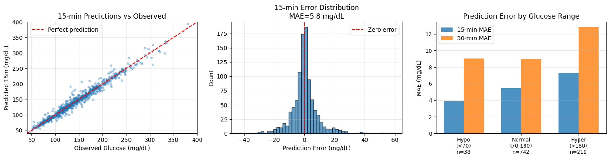
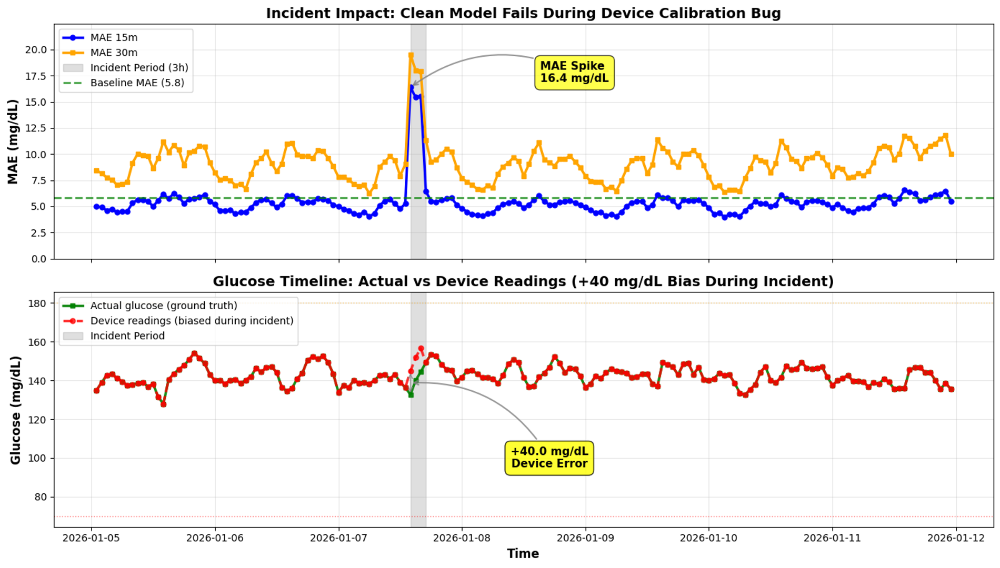
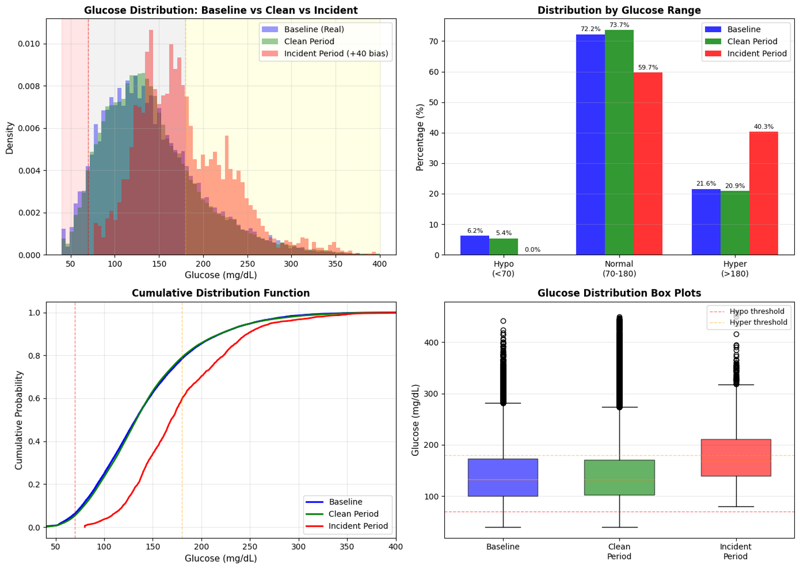

# Data + DataGen + ModelForecast (Databricks / Unity Catalog)

This folder contains a Databricks-first pipeline for:

- **Ingesting** the HUPA-UCM T1DM dataset into **Unity Catalog**
- **Extracting baseline time windows** on a 5-minute grid
- **Generating pseudo-patients**, training **XGBoost** glucose forecasting models (tracked with **MLflow**)
- **Simulating an incident** (device calibration bug) and measuring model degradation
- **Deploying** trained models to a Databricks **Model Serving** endpoint

For dataset details (cohort, modalities, preprocessing by dataset authors), see `README_data.md`.

---

## Folder contents

### Notebooks

These `.py` files start with `# Databricks notebook source` and are intended to run inside Databricks (they use `dbutils`, `spark`, Unity Catalog tables, and MLflow).

| File | Purpose / output |
| --- | --- |
| `01_download_data.py` | Download HUPA-UCM dataset ZIP and extract into a Unity Catalog Volume at `/Volumes/<CATALOG>/<SCHEMA>/<VOLUME>/...`. |
| `02_parseNcombine_processed_data.py` | Read semicolon-delimited participant CSVs from the UC Volume and write `hls_glucosphere.<schema>.diabetes_data` (Delta, partitioned by `patient_id`) and `hls_glucosphere.<schema>.diabetes_summary` (per-patient counts). |
| `03_extract_baselineTS_EDAcheck.py` | Baseline time-series extraction & QC on an observed **5-min grid**; produces baseline windows and metadata tables in Unity Catalog. |
| `dual_04_CGM_PseudoGeneration_CleanData_Modeling.py` | End-to-end pseudo-patient generation + clean-data forecasting model training (config via YAML + widgets; features: lags/rolling windows; XGBoost + MLflow tracking/registration). |
| `dual_05_CGM_Incident_Inference_DeviceCalibrationBug_SingleIncident.py` | Incident simulation + inference: inject **+40 mg/dL** bias for a subset during a 3-hour window; run “clean” models; visualize MAE degradation; write incident tables (incl. demo “fleet forecast” table). |
| `dual_06_DeployModel_as_ServingEndpoint.py` | Deploy helper: create/update a Databricks Model Serving endpoint and send test requests (uses `databricks-sdk` + MLflow/UC model refs). |
| `ExploreData4viz_app_devs.py` | Exploration / visualization scratchpad to support Databricks Apps demos (Spark reads + plotting). |

### Configs & utilities

| Path | What it’s for |
| --- | --- |
| `configs/baseline_config.yaml` | Environment-specific params (`dev` / `staging` / `prod`) for windowing, pseudo-gen, incident settings, XGBoost hyperparams, MLflow experiment path, UC model names. |
| `utils/cleanup_cgm_tables_models.ipynb` | Cleanup/list helper for Unity Catalog tables and MLflow/UC model artifacts created during iterations. |
| `utils/additional_patient_info/` | Optional: create/explore additional patient/device tables and transforms (not required for the core CGM pseudo-gen + forecasting flow). |
| `dev/` | Older “v0” variants of modeling/incident notebooks (reference only). |

---

### Suggested run order (Databricks)

1. **Ingest raw dataset**: `01_download_data.py`
2. **Parse to Delta**: `02_parseNcombine_processed_data.py` (creates `diabetes_data`, `diabetes_summary`)
3. **Baseline windows/QC**: `03_extract_baselineTS_EDAcheck.py`
4. **Pseudo-gen + model training**: `dual_04_CGM_PseudoGeneration_CleanData_Modeling.py`
5. **Incident simulation + inference**: `dual_05_CGM_Incident_Inference_DeviceCalibrationBug_SingleIncident.py`
6. **Serving**: `dual_06_DeployModel_as_ServingEndpoint.py`

---

## Figures (assets)

These figures are generated by the modeling / incident notebooks and saved under `assets/`.

In short, the flow is:

- **Pseudo-patient generation (clean data)**: `dual_04_CGM_PseudoGeneration_CleanData_Modeling.py` creates pseudo-patients from baseline windows and validates that their glucose distribution looks realistic.
- **Forecast model training (clean data)**: the same notebook trains “clean” XGBoost models for multiple horizons (e.g., 15m / 30m) and evaluates forecast errors.
- **Incident simulation + inference**: `dual_05_CGM_Incident_Inference_DeviceCalibrationBug_SingleIncident.py` injects a simulated device calibration bug (+40 mg/dL bias for a subset of patients during a window) and shows how performance degrades when models trained on clean data face biased inputs.

- **Baseline (real) vs pseudo-patient glucose distribution**:

This is a quick sanity check that pseudo-patients preserve key distributional properties of baseline glucose (overall distribution, range buckets, and quantile alignment).

- **Forecast accuracy (15m vs 30m)**:

Evaluation on clean data: scatter of predicted vs observed, error distribution (MAE), and error by glucose range (hypo/normal/hyper).

- **Incident impact summary (clean model fails, MAE spike)**:

Top-level “what went wrong” view: even a strong clean model can show a sharp MAE spike during the incident window due to biased glucose inputs.

- **Incident MAE breakdown (all vs affected vs unaffected)**:

Breakdown view to avoid dilution: fleet-wide average can hide the true impact on the affected subset (vs unaffected patients where performance stays stable).

- **True vs observed glucose during incident (+40 mg/dL bias)**:

Illustrates the incident mechanism: the “observed” device reading is shifted upward during the incident window for affected patients (while the underlying baseline trajectory is unchanged).

- **Distribution shift (baseline vs clean vs incident)**:

Shows how the incident shifts the glucose distribution (density + range breakdown + CDF + boxplots), which helps explain why the clean-trained model fails.

---

### Dependencies used and their corresponding license information

| Dependency | Where used | Why it’s used | Source / URL | License |
| --- | --- | --- | --- | --- |
| **pyspark** | `02_parseNcombine_processed_data.py`, `03_extract_baselineTS_EDAcheck.py`, `04_*`, `05_*`, `06_*`, `ExploreData4viz_app_devs.py` | Spark reads/writes, windowing, UC Delta tables | [PyPI](https://pypi.org/project/pyspark/) / [Source](https://github.com/apache/spark) | Apache-2.0 |
| **pandas** | `03_extract_baselineTS_EDAcheck.py`, `04_*`, `05_*`, `06_*`, `ExploreData4viz_app_devs.py` | DataFrames for QC, feature engineering, analysis | [PyPI](https://pypi.org/project/pandas/) / [Source](https://github.com/pandas-dev/pandas) | BSD-3-Clause |
| **numpy** | `03_extract_baselineTS_EDAcheck.py`, `04_*`, `05_*`, `06_*` | Numeric ops, feature calculations | [PyPI](https://pypi.org/project/numpy/) / [Source](https://github.com/numpy/numpy) | BSD-3-Clause |
| **requests** | `01_download_data.py`, `dual_06_DeployModel_as_ServingEndpoint.py` | Download dataset ZIP; call serving endpoints | [PyPI](https://pypi.org/project/requests/) / [Source](https://github.com/psf/requests) | Apache-2.0 |
| **PyYAML** (`yaml`) | `04_*`, `05_*`, `06_*` | Load `configs/baseline_config.yaml` | [PyPI](https://pypi.org/project/pyyaml/) / [Source](https://github.com/yaml/pyyaml) | MIT |
| **mlflow** | `04_*`, `05_*`, `06_*`, `utils/cleanup_cgm_tables_models.ipynb` | Experiment tracking, model registry, inference helpers | [PyPI](https://pypi.org/project/mlflow/) / [Source](https://github.com/mlflow/mlflow) | Apache-2.0 |
| **xgboost** | `04_*`, `05_*` (+ `%pip install xgboost`) | Forecasting model training/inference | [PyPI](https://pypi.org/project/xgboost/) / [Source](https://github.com/dmlc/xgboost) | Apache-2.0 |
| **scikit-learn** (`sklearn`) | `04_*`, `05_*` | Metrics (e.g., MAE) and utilities | [PyPI](https://pypi.org/project/scikit-learn/) / [Source](https://github.com/scikit-learn/scikit-learn) | BSD-3-Clause |
| **scipy** | `04_*` (and `dev/04_*`) | Distribution comparison metrics (KS, Wasserstein), stats | [PyPI](https://pypi.org/project/scipy/) / [Source](https://github.com/scipy/scipy) | BSD-3-Clause |
| **matplotlib** | `03_*`, `04_*`, `05_*`, `ExploreData4viz_app_devs.py` | Visualization | [PyPI](https://pypi.org/project/matplotlib/) / [Source](https://github.com/matplotlib/matplotlib) | PSF-based (Matplotlib license) |
| **seaborn** | `04_*`, `05_*` | Visualization styling + distributions | [PyPI](https://pypi.org/project/seaborn/) / [Source](https://github.com/mwaskom/seaborn) | BSD-3-Clause |
| **optuna** | `dual_04_CGM_PseudoGeneration_CleanData_Modeling.py` | Optional hyperparameter tuning | [PyPI](https://pypi.org/project/optuna/) / [Source](https://github.com/optuna/optuna) | MIT |
| **databricks-sdk** | `dual_06_DeployModel_as_ServingEndpoint.py` | Create/update Model Serving endpoints via API | [PyPI](https://pypi.org/project/databricks-sdk/) / [Docs](https://databricks-sdk-py.readthedocs.io/) | Apache-2.0 |
| **psutil** | `dual_04_CGM_PseudoGeneration_CleanData_Modeling.py` (`%pip install`) | MLflow system metrics logging | [PyPI](https://pypi.org/project/psutil/) / [Source](https://github.com/giampaolo/psutil) | BSD-3-Clause |
| **nvidia-ml-py3** | `dual_04_CGM_PseudoGeneration_CleanData_Modeling.py` (`%pip install`) | GPU metrics logging (when available) | [PyPI](https://pypi.org/project/nvidia-ml-py3/) | BSD License (OSI Approved) |
| **alembic** | `dual_04_CGM_PseudoGeneration_CleanData_Modeling.py` (`%pip install`) | Optuna SQLite storage support (per notebook comments) | [PyPI](https://pypi.org/project/alembic/) / [Source](https://github.com/sqlalchemy/alembic) | MIT |
