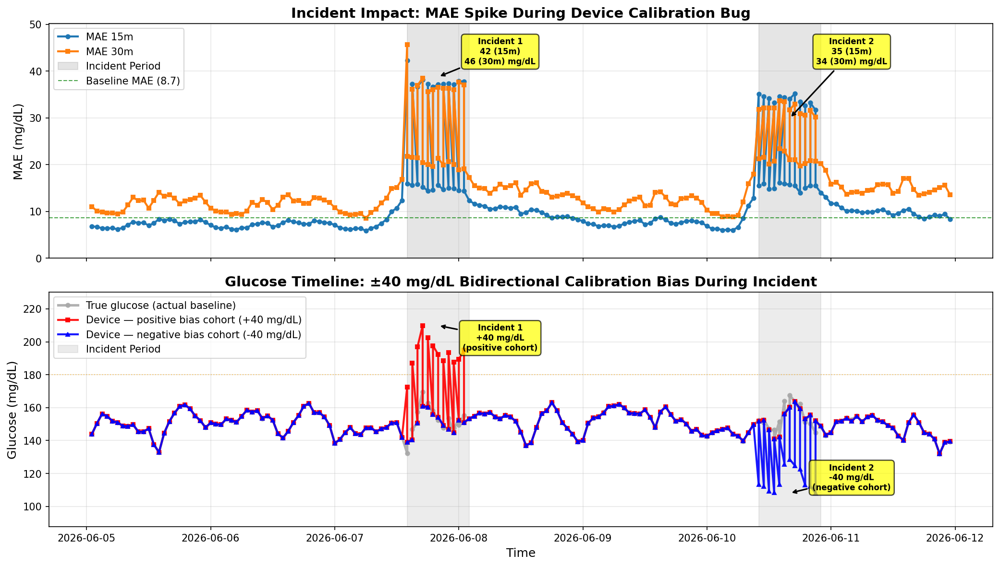

# Data + DataGen + ModelForecast (Databricks / Unity Catalog)

> **Looking for data fidelity + baseline-mode detail?** Model performance numbers (clean vs incident MAE), column-level provenance ("which columns are real vs synthetic"), and synthetic-vs-real distribution comparison all live in the sibling [`README_data_fidelity_baseline.md`](README_data_fidelity_baseline.md).

This folder contains a Databricks-first pipeline for:

- **Ingesting** the HUPA-UCM T1DM dataset into **Unity Catalog**
- **Extracting baseline time windows** on a 5-minute grid
- **Generating pseudo-patients**, training **XGBoost** glucose forecasting models (tracked with **MLflow**)
- **Simulating an incident** (device calibration bug) and measuring model degradation
- **Deploying** trained models to a Databricks **Model Serving** endpoint

For dataset details (cohort, modalities, preprocessing by dataset authors), see `README_data.md`.

---

## Folder contents

### Notebooks

These `.py` files start with `# Databricks notebook source` and are intended to run inside Databricks (they use `dbutils`, `spark`, Unity Catalog tables, and MLflow).

| File | Purpose / output |
| --- | --- |
| `01_synthetic_baseline.py` | In-cluster synthetic baseline generator. Produces `diabetes_data` + `baseline_timeseries` + `baseline_windows_metadata` directly (no external download). Used when `baseline_source=synthetic`. |
| `02_ingest_real_baseline.py` | Download HUPA-UCM T1DM dataset from Mendeley + parse semicolon-delimited per-patient CSVs into `diabetes_data` (Delta) + baseline window tables. Used when `baseline_source=from_source`. CTAS variant for `from_table` mode also lives here. |
| `03_compare_baseline_modes.py` | Side-by-side statistical comparison across `synthetic` / `from_source` / `from_table` baseline modes (n, percentiles, glycemic buckets, Kolmogorov-Smirnov tests, overlaid histograms/boxplot/bucket plots). Runs as the standalone `glucosphere_distribution_comparison` job, NOT in `glucosphere_full_setup`. |
| `04_pseudo_data_forecast_modeling.py` | Pseudo-patient generation (stratified sampler) + clean-data XGBoost forecasting model training (15-min + 30-min horizons). Config via YAML + widgets; features: lags/rolling windows; MLflow tracking + UC Model registration. |
| `05_incident_inference_bidirectional.py` | **Active** incident-simulation notebook. Two-incident mirror: Day 2 positive cohort (+40 mg/dL bias, over-reads), Day 5 negative cohort (-40 mg/dL bias, under-reads) — mutually exclusive 30%-of-fleet cohorts. **Also** injects a zero-mean device-measurement-noise σ that is **device-model-gated + two-pulse** (`%run _firmware_spec`): faulty device models (Alpha/Gamma/Beta/Delta) rise into each of the two incidents then recover gradually, while clean control models (Epsilon/Zeta) stay flat — producing the green→amber→red **device-model × firmware** device-error gradient (firmware version stays fleet-wide `3.14→4.0→4.0.3→4.1`), distinct from the acute ±40 mg/dL incidents. Writes `pseudo_incident_7d_labeled` + `fleet_forecast_incident`; generates the 4 plot PNGs consumed by the App's MetricsExplained page. |
| `06_incident_inference_single.py` | **Reference-only sibling**. Unidirectional single-incident variant (+40 mg/dL only, no negative cohort) — retained as a reference for the simpler bias model. Not wired into the main DAG; swap `databricks.yml` `incident_inference.notebook_path` back to this file to revert. |
| `07_deploy_serving_endpoints.py` | Deploy helper: create/update Databricks Model Serving endpoints for both 15m + 30m forecasts (`uses databricks-sdk` + MLflow/UC model refs). |
| `08_genie_ka_mas.py` | Provisions the three agent endpoints: **Genie space** (SQL natural-language over `gold_patient_device_readings`), **Knowledge Assistant (KA) endpoint** (RAG over `assets/who_docs/WHO_NCD_NCS_99.2.pdf`), **Multi-Agent Supervisor (MAS) endpoint** (routes clinical-guidance Qs to KA, structured-data Qs to Genie). Includes `PATCH` rebind of existing Genie space on re-run so workspace catalog migrations self-heal. |
| `09_grant_app_permissions.py` | Grants the Databricks App's service principal everything it needs: catalog `USE_CATALOG`, schema `SELECT + USE_SCHEMA`, volume `READ_VOLUME`, warehouse `CAN_USE`, and `CAN_QUERY` on the MAS / KA endpoints + Genie space. Discovers the bundle-managed warehouse by deterministic name (`glucosphere-warehouse-<target>`) when `WAREHOUSE_ID` widget is empty. |

### Configs & utilities

| Path | What it’s for |
| --- | --- |
| `configs/baseline_config.yaml` | Environment-specific params (`dev` / `staging` / `prod`) for windowing, pseudo-gen, bidirectional incident settings, XGBoost hyperparams, MLflow experiment path, UC model names. `demo_week_start` accepts `'auto'` (computes today_utc − 6 days at runtime) or a pinned date string for reproducibility. |
| `utils/validate_baseline_source.py` | First task of the workflow: validates the `baseline_source` widget enum + writes a 1-row `baseline_provenance` UC table consumed by the App's `/api/config` route. |
| `utils/check_pre_baseline_grants.py` | Pre-ingest grant verification (catalog + schema + volume privileges) before 01 or 02 runs. |
| `utils/sanity_summary.py` | Post-ingest summary metrics — verifies `diabetes_data` populated correctly regardless of which baseline_source path produced it. |
| `utils/check_post_endpoint_grants.py` | Post-deploy verification that serving endpoints are queryable + permissions set correctly. |
| `utils/validate_diabetes_data.py` | Data-quality assertions used by `sanity_summary.py` + as a standalone QC notebook. |
| `utils/data_sanity_checks.py` | **Clinical-plausibility gate** (runs post-DLT, gates `create_genie_ka_mas`) — fails the job if gold/registry contain impossible records: T2D under 13, gestational age outside 15–55, glucose outside [40,400], or a patient with no forecast row. So implausible data can't reach the app. |
| `utils/additional_patient_info/transformations.sql` | **SDP / DLT pipeline source** — bronze → silver → gold transforms for the `cgm_silver_gold` Spark Declarative Pipeline. |
| `utils/additional_patient_info/Create *.ipynb` | 3 setup notebooks: raw patient registry, raw device telemetry, patient-device link table. Wired into `glucosphere_full_setup` between `incident_inference` and `run_dlt_pipeline`. |

---

### Suggested run order (Databricks)

The `glucosphere_full_setup` job orchestrates this DAG automatically — `databricks bundle run glucosphere_full_setup -t <target>` runs the whole flow. The full task DAG (17 tasks) is in [`REPO_LAYOUT.md`](../REPO_LAYOUT.md#workflow-dag--glucosphere_full_setup). Per-notebook ordering:

1. **Validate + grants preflight**: `utils/validate_baseline_source.py` → `utils/check_pre_baseline_grants.py`
2. **Baseline ingest (one of, via condition_task dispatch on `baseline_source`)**:
   - `01_synthetic_baseline.py` (in-cluster synth) — when `baseline_source=synthetic`
   - `02_ingest_real_baseline.py` (HUPA-UCM from Mendeley OR CTAS from a table) — when `from_source` / `from_table`
3. **Sanity check**: `utils/sanity_summary.py`
4. **Pseudo-gen + model training**: `04_pseudo_data_forecast_modeling.py` (writes `cgm_xgb_15m` + `cgm_xgb_30m` UC models)
5. **Incident inference + endpoint deploy** (parallel):
   - `05_incident_inference_bidirectional.py` (writes incident tables + PNG assets)
   - `07_deploy_serving_endpoints.py` (creates 15m + 30m serving endpoints)
6. **Patient/device data setup**: 3 setup notebooks in `utils/additional_patient_info/` (registry → device telemetry → link table)
7. **SDP pipeline**: `run_dlt_pipeline` task invokes `cgm_silver_gold` pipeline (silver_* + gold_patient_device_readings tables)
8. **Data sanity gate**: `utils/data_sanity_checks.py` — fails the run on clinically-impossible records (T2D<13, implausible gestational age, glucose outside [40,400], no-forecast patients); gates the agent/app layer
9. **Agent endpoints**: `08_genie_ka_mas.py` (Genie + KA + MAS)
10. **Grant chain**: `utils/check_post_endpoint_grants.py` → `09_grant_app_permissions.py`

Standalone job (NOT in `glucosphere_full_setup`): `glucosphere_distribution_comparison` runs `03_compare_baseline_modes.py` for side-by-side baseline-mode statistical comparison.

---

## Figures (assets)

Notebooks `04_*` (forecast modeling), `05_*` (bidirectional incident inference), and `06_*` (single-incident inference reference sibling) generate the figures saved under [`assets/`](assets/). Full set + descriptions of each — pseudo-patient vs baseline distribution, 15m/30m forecast accuracy, incident impact summary, fleet-wide-dilution MAE breakdown, true-vs-observed glucose during incident, 4-class distribution shift — lives in the sibling [`README_data_fidelity_baseline.md`](README_data_fidelity_baseline.md#forecast-model-performance).

  

<em>Incident impact summary: MAE spike + bidirectional ±40 mg/dL glucose timeline (Day 2 over-read cohort, Day 5 under-read cohort). Click through to <a href="README_data_fidelity_baseline.md#forecast-model-performance">the full set + descriptions</a>.</em>

---

### Dependencies & licenses

Full dependency + license inventory (incl. the package-URL / network-reachability note)
lives in [`DEPENDENCIES.md`](DEPENDENCIES.md).

---

## References

- **Nature Digital Medicine — [`s41746-021-00480-x`](https://www.nature.com/articles/s41746-021-00480-x)** (Deng et al. 2021) — provides alternative approaches for CGM monitoring and forecasting (patient-specific deep-learning via transfer learning) and guidance on relevant metrics of interest (MAE / RMSE across 5-60 min horizons). Glucosphere takes a different path — fleet-level XGBoost on pseudo-patient cohorts — for demonstration simplicity; the paper is a reference for what patient-specific clinical-grade modeling could look like.
