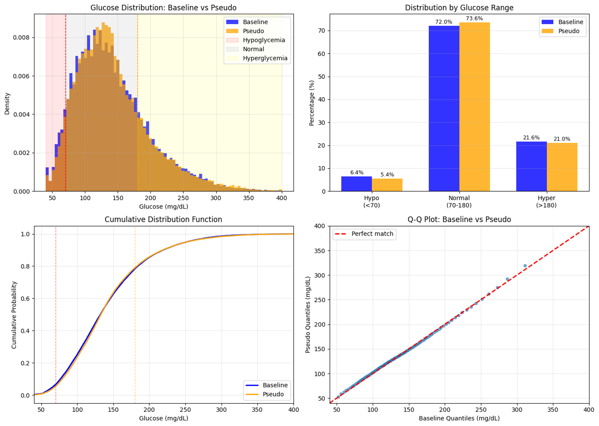
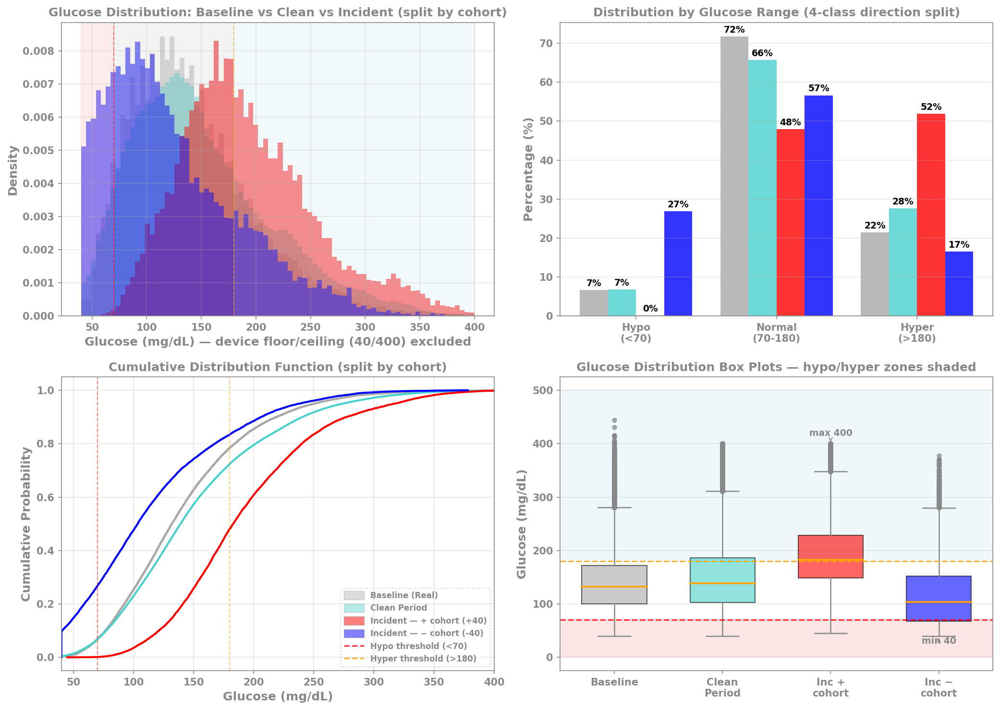
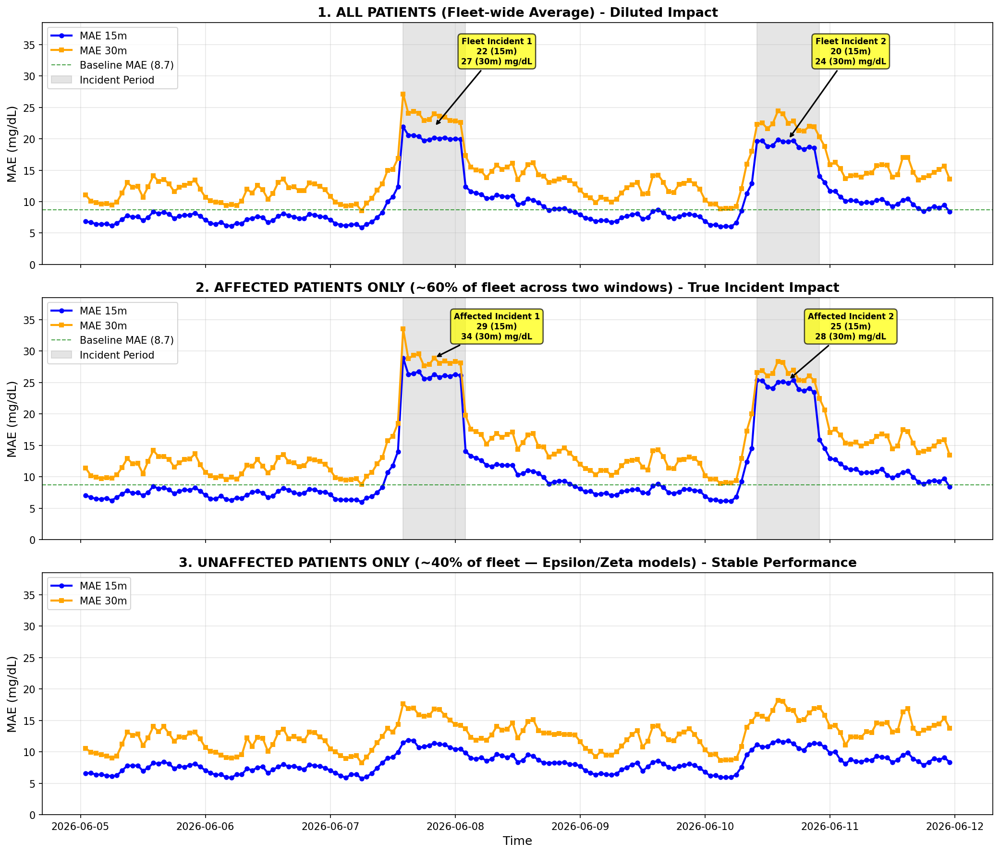
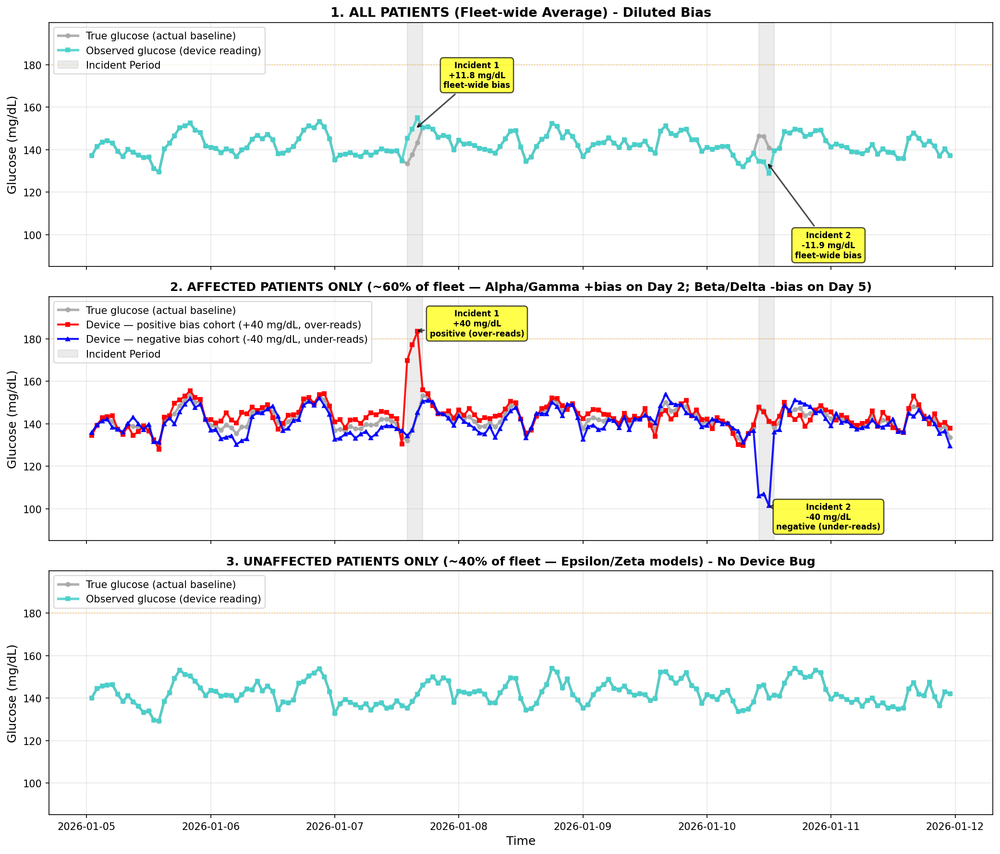

# Data fidelity & forecast model performance

This explainer lives next to the pipeline code that produces it ([`Data_DataGen_ModelForecast/`](.)). The repo-root [`README.md`](../README.md) carries a short teaser + link here; per-notebook detail still lives in [`Data_DataGen_ModelForecast/README.md`](README.md).

**How this doc is organized**: baseline modes → column-level provenance → synthetic-vs-real distribution comparison → forecast model performance under simulated incidents.

## Baseline source modes

Glucosphere supports three **baseline source modes** for the CGM data that feeds every downstream model and dashboard. The mode is selected at deploy time via the bundle variable `baseline_source`. The downstream notebooks (`04_*`, `05_*`, `06_*`) read a single contract table — `diabetes_data` — and don't know which mode produced it.

| Mode | Source of glucose / insulin / wearable signals | Patient count | Default? | When to use |
|---|---|---|---|---|
| `from_source` | Downloaded from Mendeley (HUPA-UCM dataset, Universidad Complutense de Madrid) | 25 real type-1 diabetes patients (oversampled to 1,000) | ✅ default | Buildathon demos + anything that benefits from real clinical extremes (hypoglycemia events, hyperglycemia outliers up to ~450 mg/dL, realistic CGM signal noise). |
| `synthetic` | In-cluster generator: textbook diabetes phenotype + AR(1) glucose dynamics | 1,000 pseudo-patients | opt-in via `--var` | CI / smoke tests / restricted-egress workspaces (no network call to Mendeley) / scenarios where deterministic in-cluster generation is preferred. |
| `from_table` | CTAS from an existing UC table you point at | configurable via widgets | opt-in via `--var` | Once you've ingested HUPA-UCM elsewhere and want to mirror without re-downloading. |

**Why `from_source` is the default**: the buildathon demo is built around clinical realism — real CGM signal dynamics, sustained hyperglycemic events, hypoglycemia incidents, sensor outliers. Synthetic mode produces a "well-managed diabetes" idealization that under-stresses the anomaly detection, MAS clinical reasoning, and MAE-shift incident demos. The Mendeley URL has been reliable across multiple runs. Synthetic stays available via `--var "baseline_source=synthetic"` for CI / restricted-egress scenarios.

Synthetic distributions are narrow and require iterated phenotype curation to populate the hypo + hyper strata that real HUPA-UCM gives for free. Bidirectional incident simulation (over-reading AND under-reading device calibration bugs) needs both natural tails populated — real-baseline mode provides this without artificial construction. Full historical analysis lives in [`../CHANGELOG.md`](../CHANGELOG.md) under "Synthetic vs real data — structural realism for incident simulation".

## Column-level provenance

"Real-baseline mode" does **NOT** mean every column is real — provenance is per-column (this is important and easy to mis-explain):

| Column class | `synthetic` | `from_*` |
|---|---|---|
| `glucose`, `calories`, `heart_rate`, `steps`, `basal_rate`, `bolus_volume_delivered`, `carb_input` | synthetic | **real** (HUPA-UCM) |
| 5-min reading cadence | synthetic | real (FreeStyle Libre 2) |
| `patient_id`, `device_id`, demographics, device model, firmware | always synthetic | always synthetic |
| Incident flags (calibration bug) | synthetic simulation | synthetic simulation overlaid on real glucose |
| Forecast values | XGBoost on synthetic | XGBoost on real-derived |

In real-mode, what you get is **real CGM signal dynamics carried by synthetic patient identities and device-fleet metadata** — i.e. pseudo-patients with real clinical waveforms. This is a deliberate privacy + demo property.

**Concise framing for documentation, presentations, and demos:**

- "Glucose values and Fitbit readings are from real type-1 diabetes patients (HUPA-UCM dataset)."
- "Patient names, device IDs, demographics, and incident scenarios are synthetic for privacy and demo purposes."

## Synthetic vs real — distribution comparison

| metric | synthetic | from_source |
|---|---:|---:|
| glucose mean (mg/dL) | 134.9 | 141.4 |
| glucose std (mg/dL) | 34.0 | 57.1 |
| glucose p95 (mg/dL) | 189.4 | 251.3 |
| glucose max (mg/dL) | 251.0 | 444.0 |
| % hypoglycemia (<70) | 0.14% | 6.59% |
| % normal (70-180) | 89.71% | 71.72% |
| % hyperglycemia (>180) | 10.15% | 21.70% |

Synthetic produces a "well-managed diabetes" idealization; real captures genuine clinical extremes. Medians are nearly identical (133 vs 132 mg/dL) — the divergence is in the tails. See the `glucosphere_distribution_comparison` job ([`databricks.yml`](../databricks.yml)) for the standalone analytics notebook + plots.

### Pseudo-patient sanity check

A quick sanity check that pseudo-patients preserve key distributional properties of baseline glucose (overall distribution, range buckets, and quantile alignment):

### Distribution shift under incident overlay

The bidirectional incident overlay shifts glucose distribution by cohort — baseline (darkgray), clean period (mediumturquoise), Inc+ over-reads (red, shifts into hyper >180), Inc− under-reads (blue, shifts into hypo <70). Helps explain why a clean-trained model fails on both directions:

## Forecast model performance

The forecast model (`cgm_xgb_15m@Champion` / `cgm_xgb_30m@Champion`) is trained on real HUPA-UCM-derived data and evaluated under a simulated +40 mg/dL device calibration bug overlay:

| Period | Timepoints | MAE 15m | MAE 30m |
|---|---:|---:|---:|
| Clean (no device bug) | 588,550 | **5.3 mg/dL** | **9.2 mg/dL** |
| Incident (+40 mg/dL bias, 3-hour window, 300/1000 patients affected) | 3,218 | **38.8 mg/dL** | **37.7 mg/dL** |
| Degradation | — | **+631%** | **+310%** |

A well-tuned model performs at published-research-quality on clean data (~5 mg/dL MAE for 15-minute glucose forecasting), then **degrades catastrophically — by over 6× — when device calibration is compromised**. This is the load-bearing motivation for the platform's fleet-level device anomaly detection: forecast MAE alone surfaces the problem within minutes of incident onset.

Real-trained vs synthetic-trained models produce nearly identical numbers (the published synthetic-trained baseline was 5.8 / 10.4 mg/dL clean, 38.3 / 36.8 incident), so this story is consistent across baseline modes. See [`05_incident_inference_bidirectional.py`](05_incident_inference_bidirectional.py) for the active inference notebook (two-incident mirror, bidirectional cohort split). The simpler [`06_incident_inference_single.py`](06_incident_inference_single.py) sibling retains the unidirectional single-incident variant for reference.

### Clean-data forecast accuracy

Evaluation on clean data — scatter of predicted vs observed, error distribution (MAE), and error by glucose range (hypo/normal/hyper):

### Top-level incident impact

Top-level "what went wrong" view — MAE spikes during incident windows while the bidirectional glucose timeline shows the positive cohort (red, over-reads UP) on Day 2 and the negative cohort (blue, under-reads DOWN) on Day 5:

### Affected-vs-unaffected MAE breakdown

Fleet-wide MAE averages hide the true impact on the affected subset (~25 mg/dL spike) vs unaffected patients (performance stable). The three-panel breakdown surfaces the dilution effect:

### Incident mechanism — true vs observed

Three-panel illustration of the incident mechanism — fleet-wide observed (mediumturquoise) vs true (darkgray) shows diluted bias on top; affected-only panel breaks into positive (red, over-reads) and negative (blue, under-reads) cohorts; unaffected panel shows stable readings (device OK):

## See also

- [`Data_DataGen_ModelForecast/README.md`](README.md) — folder contents, suggested run order, dependencies
- [`../README.md`](../README.md) — repo-root orientation
- [`../DEPLOY.md`](../DEPLOY.md) — step-by-step deploy guide (covers `--var "baseline_source=synthetic"` placement gotcha)
