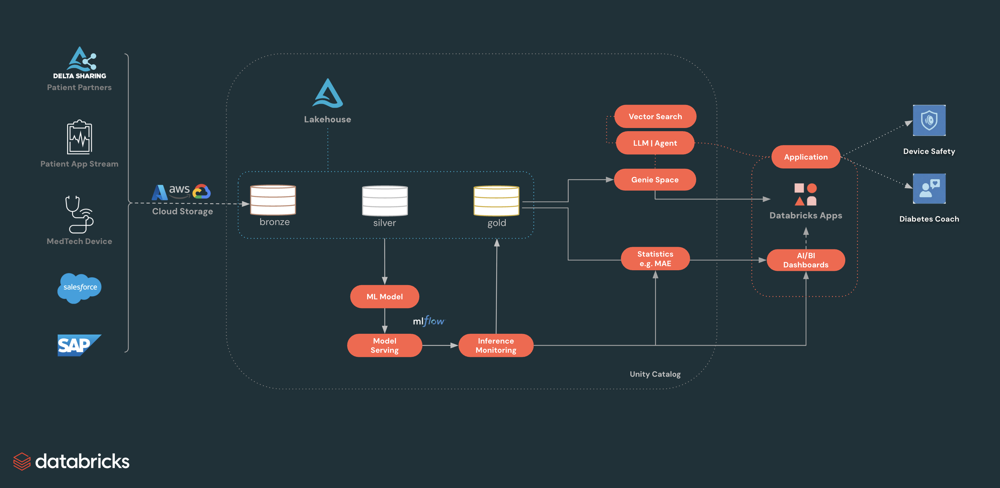

# hls-glucosphere

## Overview

This repo contains two main parts that work together:

- **`Data_DataGen_ModelForecast/`**: Databricks notebooks/scripts to ingest Continuous Glucose Monitoring (CGM) data, generate pseudo-patients, train forecasting models, simulate incidents, and deploy models to serving.
- **`App/`**: The dashboard “front-end” (Databricks App) that integrates **Genie Space** and **Agents**. It reads curated **bronze/silver/gold** tables derived from patient **CGM/IoT** signals (see [`Data_DataGen_ModelForecast/README_data.md`](Data_DataGen_ModelForecast/README_data.md)).

**glucosphere concept**: a monitoring “engine/sphere” on the Databricks platform that turns CGM + context data into curated signals, forecasts, and incident monitoring, then surfaces **actionable insights** via dashboards and agentic workflows (Genie / multi-agent tools) for multiple personas (e.g., physicians, caregivers, patients, device/MedTech teams, and regulators such as FDA review boards).

## Power of this solution

- **End-to-end monitoring sphere**: one coherent loop from CGM + context data → curated tables → forecasting/incident analytics → dashboards + agentic workflows.
- **Actionable, not just descriptive**: produces KPIs, alerts, and explanations teams can act on (e.g., calibration-bug detection via performance + distribution shifts).
- **Multi‑persona leverage**: supports physicians/caregivers, device/MedTech teams, patients, and regulators with views tailored to their needs—backed by the same governed data/model layer.
- **Flexible integration**: exposes both **inference tables** (easy DBSQL consumption) and **serving endpoints** (for real-time use when needed).
- **Governance + auditability**: Unity Catalog + MLflow provide lineage/traceability from data → curated tables/inference outputs → models → downstream metrics, improving trust, operations, and compliance. Feature tables can be incorporated later if/when needed.

## Architecture



## Data fidelity & baseline modes

Glucosphere supports three **baseline source modes** for the CGM data that feeds every downstream model and dashboard. The mode is selected at deploy time via the bundle variable `baseline_source`. The downstream notebooks (`04_*`, `05_*`, `06_*`) read a single contract table — `diabetes_data` — and don't know which mode produced it.

| Mode | Source of glucose / insulin / wearable signals | Patient count | Default? | When to use |
|---|---|---|---|---|
| `from_source` | Downloaded from Mendeley (HUPA-UCM dataset, Universidad Complutense de Madrid) | 25 real type-1 diabetes patients (oversampled to 1,000) | ✅ default | Buildathon demos + anything that benefits from real clinical extremes (hypoglycemia events, hyperglycemia outliers up to ~450 mg/dL, realistic CGM signal noise). |
| `synthetic` | In-cluster generator: textbook diabetes phenotype + AR(1) glucose dynamics | 1,000 pseudo-patients | opt-in via `--var` | CI / smoke tests / restricted-egress workspaces (no network call to Mendeley) / scenarios where deterministic in-cluster generation is preferred. |
| `from_table` | CTAS from an existing UC table you point at | configurable via widgets | opt-in via `--var` | Once you've ingested HUPA-UCM elsewhere and want to mirror without re-downloading. |

**Why `from_source` is the default** (changed 2026-05-16, empirically reaffirmed 2026-05-26): the buildathon demo is built around clinical realism — real CGM signal dynamics, sustained hyperglycemic events, hypoglycemia incidents, sensor outliers. Synthetic mode produces a "well-managed diabetes" idealization that under-stresses the anomaly detection, MAS clinical reasoning, and MAE-shift incident demos. The Mendeley URL has been reliable across multiple runs. Synthetic stays available via `--var "baseline_source=synthetic"` for CI / restricted-egress scenarios.

End-to-end harness testing on 2026-05-26 found this empirically: synthetic distributions are narrow and require iterated phenotype curation to populate the hypo + hyper strata that real HUPA-UCM gives for free. Bidirectional incident simulation (over-reading AND under-reading device calibration bugs) needs both natural tails populated — real-baseline mode provides this without artificial construction. Full analysis + iteration log in `CHANGELOG.md` (`[2026-05-26]` section, "Synthetic vs real data — structural realism for incident simulation").

### Model performance — clean vs incident (2026-05-16, real-trained)

The forecast model (`cgm_xgb_15m@Champion` / `cgm_xgb_30m@Champion`) trained on real HUPA-UCM-derived data, evaluated under a simulated +40 mg/dL device calibration bug overlay:

| Period | Timepoints | MAE 15m | MAE 30m |
|---|---:|---:|---:|
| Clean (no device bug) | 588,550 | **5.3 mg/dL** | **9.2 mg/dL** |
| Incident (+40 mg/dL bias, 3-hour window, 300/1000 patients affected) | 3,218 | **38.8 mg/dL** | **37.7 mg/dL** |
| Degradation | — | **+631%** | **+310%** |

A well-tuned model performs at published-research-quality on clean data (~5 mg/dL MAE for 15-minute glucose forecasting), then **degrades catastrophically — by over 6× — when device calibration is compromised**. This is the load-bearing motivation for the platform's fleet-level device anomaly detection: forecast MAE alone surfaces the problem within minutes of incident onset.

Real-trained vs synthetic-trained models produce nearly identical numbers (the synthetic-trained baseline in `origin/hls-buildathon-main` was 5.8 / 10.4 mg/dL clean, 38.3 / 36.8 incident), so this story is consistent across baseline modes. See `Data_DataGen_ModelForecast/05_incident_inference_bidirectional.py` for the active inference notebook (two-incident mirror, bidirectional cohort split). The simpler `06_incident_inference_single.py` sibling retains the unidirectional single-incident variant for reference.

### Column-level provenance (important — easy to mis-explain)

"Real-baseline mode" does **NOT** mean every column is real. Provenance is per-column:

| Column class | `synthetic` | `from_*` |
|---|---|---|
| `glucose`, `calories`, `heart_rate`, `steps`, `basal_rate`, `bolus_volume_delivered`, `carb_input` | synthetic | **real** (HUPA-UCM) |
| 5-min reading cadence | synthetic | real (FreeStyle Libre 2) |
| `patient_id`, `device_id`, demographics, device model, firmware | always synthetic | always synthetic |
| Incident flags (calibration bug) | synthetic simulation | synthetic simulation overlaid on real glucose |
| Forecast values | XGBoost on synthetic | XGBoost on real-derived |

In real-mode, what you get is **real CGM signal dynamics carried by synthetic patient identities and device-fleet metadata** — i.e. pseudo-patients with real clinical waveforms. This is a deliberate privacy + demo property.

**How to explain externally:**
- "Glucose values and Fitbit readings are from real type-1 diabetes patients (HUPA-UCM dataset)."
- "Patient names, device IDs, demographics, and incident scenarios are synthetic for privacy and demo purposes."

### How synthetic and real compare (verified 2026-05-16)

| metric | synthetic | from_source |
|---|---:|---:|
| glucose mean (mg/dL) | 134.9 | 141.4 |
| glucose std (mg/dL) | 34.0 | 57.1 |
| glucose p95 (mg/dL) | 189.4 | 251.3 |
| glucose max (mg/dL) | 251.0 | 444.0 |
| % hypoglycemia (<70) | 0.14% | 6.59% |
| % normal (70-180) | 89.71% | 71.72% |
| % hyperglycemia (>180) | 10.15% | 21.70% |

Synthetic produces a "well-managed diabetes" idealization; real captures genuine clinical extremes. Medians are nearly identical (133 vs 132 mg/dL) — the divergence is in the tails. See `glucosphere_distribution_comparison` job for the standalone analytics notebook + plots.

## Repository structure

High-level layout:

```text
/
├── databricks.yml                                # Bundle entry: targets, variables, resources
├── DEPLOY.md                                     # Step-by-step deploy guide
├── scripts/
│   └── render_app_yaml.py                        # Per-target app.yaml templating
├── App/
│   ├── src/                                      # React UI (pages/components/api)
│   ├── databricks/                               # App runtime config (app.yaml, app.py)
│   ├── package.json                              # Frontend deps
│   └── README.md
├── Data_DataGen_ModelForecast/
│   ├── assets/                                   # Architecture diagrams, plots
│   ├── configs/                                  # Pipeline parameters
│   ├── utils/
│   │   ├── validate_baseline_source.py      # Enum + banner preflight
│   │   ├── validate_diabetes_data.py        # Schema contract check (cols, cadence, coverage)
│   │   ├── sanity_summary.py                # Non-empty + plausible-range assertion
│   │   ├── check_pre_baseline_grants.py     # Try-create-drop probe (catalog/schema/volume)
│   │   ├── check_post_endpoint_grants.py    # KA/MAS/Genie existence check
│   │   └── additional_patient_info/              # Registry + device + telemetry generators
│   ├── 01_synthetic_baseline.py    # baseline_source = synthetic
│   ├── 02_ingest_real_baseline.py           # baseline_source = from_source | from_table
│   ├── 03_compare_baseline_modes.py         # Standalone analytics (synthetic vs real)
│   ├── 04_pseudo_data_forecast_modeling.py
│   ├── 06_incident_inference_single.py
│   ├── 07_deploy_serving_endpoints.py
│   ├── 08_genie_ka_mas.py            # KA + MAS + Genie tile setup
│   ├── 09_grant_app_permissions.py               # App SP grants on UC + endpoints + warehouse
│   ├── README.md
│   └── README_data.md
└── README.md
```

### `Data_DataGen_ModelForecast/` (data + models)

- **What it does**: Ingest → baseline windows → pseudo-patient generation → clean-model training → incident simulation → model serving.
- **Key outputs**:
  - Unity Catalog **Delta tables** (bronze/silver/gold-style progression)
  - MLflow-tracked **forecast models** (e.g., 15m/30m horizons)
  - Incident-labeled tables and “fleet forecast” demo tables
- **Assets**:
  - `Data_DataGen_ModelForecast/assets/`: generated figures used in documentation (forecast accuracy, incident impact, distribution shifts).
  - `Data_DataGen_ModelForecast/configs/baseline_config.yaml`: environment-specific pipeline parameters.

### `App/`

Databricks App code (UI + dashboards + **Genie/Agent** experiences). The app reads curated bronze/silver/gold tables (and inference outputs) produced by `Data_DataGen_ModelForecast/`.

## How the two parts work together

- **Data → App**:
  - `Data_DataGen_ModelForecast/` produces curated UC tables, **inference / fleet-forecast tables**, and (optionally) **model serving endpoints**.
  - The app **queries tables** (e.g., via DBSQL) to render **forecast metrics**, **incident monitoring**, and **fleet-level KPIs**.
  - In the future, the app could call **model serving endpoints** and/or integrate the **inference tables** and incoming patient/IoT data to incorporate predictions directly into the UI.
- **Agents / Genie**:
  - The app can hook into **multi-agent systems** and use **Genie Space** as a tool to provide a comprehensive, Databricks-native UI experience.
- **Assets**:
  - `Data_DataGen_ModelForecast/assets/` contains analysis figures for documentation and stakeholder storytelling.
  - The `App/` folder may include its own UI assets (icons/images) for the frontend (separate from analysis figures).

---

## Getting started

### Prerequisites

- Databricks CLI configured for your target workspace (`databricks auth login --host <workspace-url>`)
- UC catalog you can write to + SQL warehouse to query through
- [uv](https://docs.astral.sh/uv/) installed locally — run `uv sync` once in the repo root to create the project venv (Python 3.11 per `.python-version`) used by `scripts/render_app_yaml.py`. Prefix the script with `uv run` to invoke without manual activation. See [`DEPLOY.md`](DEPLOY.md) for the full deploy sequence.

### Deploy the pipeline + app (default — real HUPA-UCM data)

Canonical full sequence — see [`DEPLOY.md`](DEPLOY.md) for the 10-step walkthrough with explanations. Sketch:

```bash
source .env.bundle                                                              # load BUNDLE_VAR_* + DATABRICKS_CONFIG_PROFILE

# Two-pass deploy (first deploy creates the warehouse; render fills WAREHOUSE_ID into app.yaml)
databricks bundle deploy -t <target> --profile <profile>                        # pass 1
uv run python scripts/render_app_yaml.py --target <target> --profile <profile>
databricks bundle deploy -t <target> --profile <profile>                        # pass 2

# Run the setup job (~45 min — ingest + modeling + DLT silver/gold + KA/MAS/Genie + grants)
databricks bundle run glucosphere_full_setup -t <target> --profile <profile>

# Re-render with KA/MAS/Genie IDs from job logs + redeploy (first-deploy-only on fresh workspace)
uv run python scripts/render_app_yaml.py --target <target> --profile <profile> \
    --mas-endpoint <name> --ka-endpoint <name> --genie-space-id <id>
databricks bundle deploy -t <target> --profile <profile>

# Start the App
databricks bundle run glucosphere_app -t <target> --profile <profile>

# Automated smoke-test gate (6 checks: App state, URL serving, warehouse, gold-table data,
# KA/MAS endpoints, Genie space) — runs in ~15-30s, exits non-zero on any failure
uv run python scripts/smoke_test.py --target <target> --profile <profile>
```

End-to-end wall clock: **~48 min on subsequent deploys** (reuses existing KA/MAS/Genie + model serving endpoints) and **~51 min on first deploy to a fresh workspace** (CREATE path for KA/MAS/Genie + model serving endpoints — only ~3 min slower than reuse). The setup job alone dominates at ~45-48 min — longest tasks are `deploy_model_endpoints` (~22 min), `datagen_modeling` (~13 min), `ingest_real_baseline` (~7-8 min). Deploy + render + App start + smoke test adds ~3 min. Produces 1,000 pseudo-patients oversampled from 25 real type-1 diabetes patients (HUPA-UCM dataset). Real CGM / insulin / wearable signal dynamics with clinical extremes.

> **Note:** The first deploy downloads the HUPA-UCM zip from Mendeley (~25 MB) and auto-creates the `raw_baseline` UC Volume. No pre-setup needed.

### Deploy with synthetic baseline instead

For CI, smoke tests, or restricted-egress workspaces where the Mendeley download is unavailable, swap the baseline_source on **pass 1** of the canonical sequence:

```bash
databricks bundle deploy -t <target> --var "baseline_source=synthetic" --profile <profile>   # pass 1 only
# (remaining steps — render, pass 2, setup job, post-job re-render, App start — same as default)
```

End-to-end runtime is slightly shorter than the real-data path because the synthetic baseline ingest (`01_synthetic_baseline.py`) is in-cluster (no Mendeley download), shaving ~7-8 min off the `ingest_real_baseline` task. The bulk of the runtime (model endpoint deploy + datagen modeling) is unchanged, so realistic wall clock is **~40 min subsequent / ~43 min first deploy**. Produces 1,000 pseudo-patients with textbook diabetes phenotypes + AR(1) glucose dynamics — useful for prototyping + deterministic regression testing.

> ⚠️ **`--var` placement matters:** it MUST go on `bundle deploy`, not `bundle run`. The `${var.baseline_source}` in the dispatch condition is interpolated at deploy time. Putting `--var` on `bundle run` silently routes to whatever the deployed default is.

To restore the real-data default afterward, redeploy pass 1 without the `--var` flag (the rest of the sequence runs the same).

### Verify which mode dispatched

The first task of every job run (`validate_baseline_source`) prints a banner showing the dispatched mode + catalog + schema. Open it in the Workflows run UI for unambiguous after-the-fact verification.

### Distribution comparison

Once at least two modes have been populated (e.g., synthetic + a real-mode snapshot in a sandbox schema), trigger the standalone comparison job:

```bash
databricks bundle run -t <target> glucosphere_distribution_comparison \
  --profile <profile>
```

Or click "Run now with different parameters" in Workflows UI and point at least 2 of `SYNTHETIC_SCHEMA` / `FROM_SOURCE_SCHEMA` / `FROM_TABLE_SCHEMA` at the schemas you want compared (replace the `<placeholder>` defaults with real schema names; leave or clear the others to skip). Emits side-by-side stats (n, percentiles, glycemic buckets), pairwise Kolmogorov-Smirnov test, and three inline matplotlib plots (overlaid histograms, boxplot, bucket %). PNGs auto-save to a UC Volume.

### See also

- **[REPO_LAYOUT.md](REPO_LAYOUT.md)** — repository navigation guide for new contributors: which files do what, the full workflow DAG, what's PR-shipped vs internal-refs (gitignored)
- **[DEPLOY.md](DEPLOY.md)** — step-by-step first-time deploy guide with troubleshooting + post-deploy smoke-test checklist
- **[Data_DataGen_ModelForecast/README.md](Data_DataGen_ModelForecast/README.md)** — pipeline + modeling guide, methodology references
- **[Data_DataGen_ModelForecast/README_data.md](Data_DataGen_ModelForecast/README_data.md)** — schema documentation for curated tables
- **[App/README.md](App/README.md)** — frontend dev setup
- **[CHANGELOG.md](CHANGELOG.md)** — dated history of every commit group
- `Data_DataGen_ModelForecast/assets/architecture.png` — system architecture diagram. Lakehouse (bronze/silver/gold via SDP) + Lakeflow + Lakebase OLTP instance (provisioned via the bundle's `database_instances.glucosphere_oltp` resource) + Unity Catalog + Vector Search + LLM / Agent (KA + MAS) + Genie Space + ML Model / Serving / Inference Monitoring + AI/BI Dashboards + Databricks App, with Delta Sharing / Salesforce / SAP / Patient App Stream / MedTech Device as external data sources.

## For maintainers — optional Claude Code plugins

If you use [Claude Code](https://docs.claude.com/en/docs/claude-code/overview) (Anthropic CLI) as your AI coding assistant, this project's `CLAUDE.md` (when present) auto-loads project-specific guidance. **No plugins required to deploy or run Glucosphere** — they only help when authoring, extending, or debugging the codebase.

### Public Claude Code plugins (anyone)

Useful general dev plugins from the public Anthropic marketplace — install via `/plugin install <name>` in Claude Code:

| Plugin | Why |
|---|---|
| `code-review` | PR code review automation |
| `pr-review-toolkit` | Deeper PR review patterns |
| `commit-commands` | `/commit` and `/commit-push-pr` shortcuts |
| `feature-dev` | Feature development scaffolding |
| `claude-md-management` | CLAUDE.md improver — keeps project context current |
| `skill-creator` | Create your own Claude Code skills |
| `github` | GitHub integration |
| `security-guidance` | Security review patterns |
| `playwright` | Browser automation for end-to-end testing |
| `claude-notify` | macOS desktop notifications for Claude completion events |

After each install, Claude Code prompts you to run `/reload-plugins` to apply. Plugins persist across sessions, re-logins, and Claude Code updates (one-time setup per machine).

### Databricks employees — internal plugin marketplace

Databricks Field Engineering maintains an internal `fe-vibe` plugin marketplace with Databricks-specific plugins (Lakebase, Apps, bundles, jobs, Genie, MAS, SDK). These are not accessible outside the Databricks corp network.

**If you're a Databricks employee**, see [`docs/internal-setup.md`](docs/internal-setup.md) for the marketplace setup (git HTTPS rewrite, install flow, recommended Persona A/B plugin sets, known issues).

## Contributors

Glucosphere came together in three phases.

**Origins.** Two pre-Buildathon threads:

- **MedTech Q4 QBR Hackathon (Nov 4, 2025, Denver)** — Jon Van Hofwegen, Sabrina Wang, Sumanth Ghanta, May Merkle-Tan. May coined "Glucosphere" and built the data/ML foundations (real CGM data source, forecast-monitoring ML, statistical online-monitoring approach). Jon and Sabrina integrated the Multi-Agent Supervisor (MAS) piece — the agentic layer.
- **Prior faulty-firmware device demo** — Morgan Williams (customer-driven). Became the incident-simulation scaffolding. Used non-biological synthetic data.

**Buildathon FY26Q4 — Team 11 (HLS), "Real-time Digital Health Apps for Connected Devices"** (Justin Ward, Morgan Williams, May Merkle-Tan, Nikita Kamraj, Sabrina Wang). The two threads merged here — Morgan reached out after the MedTech-hackathon pitch. **Morgan Williams** integrated his prior work's ingest of the device generator output + patient attributes into a pseudo-online DLT pipeline. **Justin Ward** led appification: introduced the [ai-dev-kit](https://github.com/databricks-solutions/ai-dev-kit), turned the notebooks into a Databricks App + React frontend, scaffolded the bundle. **May Merkle-Tan** integrated her prior CGM-data + forecast-monitoring ML work and grounded the device story with real-life FDA recall context.

**Post-buildathon hardening + future feature work.** Led by May Merkle-Tan, Justin Ward, Morgan Williams — MVP tidy-up + future feature adds.
