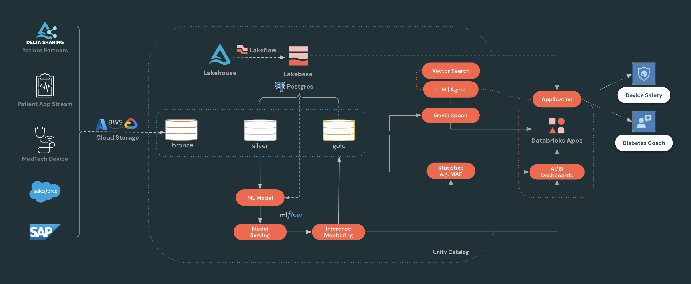

# hls-glucosphere

## Overview

This repo contains two main parts that work together:

- **`Data_DataGen_ModelForecast/`**: Databricks notebooks/scripts to ingest Continuous Glucose Monitoring (CGM) data, generate pseudo-patients, train forecasting models, simulate incidents, and deploy models to serving.
- **`App/`**: The dashboard “front-end” (Databricks App) that integrates **Genie Space** and **Agents**. It reads curated **bronze/silver/gold** tables derived from patient **CGM/IoT** signals (see [`Data_DataGen_ModelForecast/README_data.md`](Data_DataGen_ModelForecast/README_data.md)).

**glucosphere concept**: a monitoring “engine/sphere” on the Databricks platform that turns CGM + context data into curated signals, forecasts, and incident monitoring, then surfaces **actionable insights** via dashboards and agentic workflows (Genie / multi-agent tools) for multiple personas (e.g., physicians, caregivers, patients, device/MedTech teams, and regulators such as FDA review boards).

## Power of this solution

- **End-to-end monitoring sphere**: one coherent loop from CGM + context data → curated tables → forecasting/incident analytics → dashboards + agentic workflows.
- **Actionable, not just descriptive**: produces KPIs, alerts, and explanations teams can act on (e.g., calibration-bug detection via performance + distribution shifts).
- **Multi‑persona leverage**: supports physicians/caregivers, device/MedTech teams, patients, and regulators with views tailored to their needs—backed by the same governed data/model layer.
- **Flexible integration**: exposes both **inference tables** (easy DBSQL consumption) and **serving endpoints** (for real-time use when needed).
- **Governance + auditability**: Unity Catalog + MLflow provide lineage/traceability from data → curated tables/inference outputs → models → downstream metrics, improving trust, operations, and compliance. Feature tables can be incorporated later if/when needed.

## Architecture



## Data fidelity & baseline modes

Glucosphere supports three **baseline source modes** for the CGM data that feeds every downstream model and dashboard. The mode is selected at deploy time via the bundle variable `baseline_source`. The downstream notebooks (`04_*`, `05_*`, `06_*`) read a single contract table — `diabetes_data` — and don't know which mode produced it.

| Mode | Source of glucose / insulin / wearable signals | Patient count | Default? | When to use |
|---|---|---|---|---|
| `real_from_source` | Downloaded from Mendeley (HUPA-UCM dataset, Universidad Complutense de Madrid) | 25 real type-1 diabetes patients (oversampled to 1,000) | ✅ default | Buildathon demos + anything that benefits from real clinical extremes (hypoglycemia events, hyperglycemia outliers up to ~450 mg/dL, realistic CGM signal noise). |
| `synthetic` | In-cluster generator: textbook diabetes phenotype + AR(1) glucose dynamics | 1,000 pseudo-patients | opt-in via `--var` | CI / smoke tests / restricted-egress workspaces (no network call to Mendeley) / scenarios where deterministic in-cluster generation is preferred. |
| `real_from_table` | CTAS from an existing UC table you point at | configurable via widgets | opt-in via `--var` | Once you've ingested HUPA-UCM elsewhere and want to mirror without re-downloading. |

**Why `real_from_source` is the default** (changed 2026-05-16): the buildathon demo is built around clinical realism — real CGM signal dynamics, sustained hyperglycemic events, hypoglycemia incidents, sensor outliers. Synthetic mode produces a "well-managed diabetes" idealization that under-stresses the anomaly detection, MAS clinical reasoning, and MAE-shift incident demos. The Mendeley URL has been reliable across multiple runs. Synthetic stays available via `--var "baseline_source=synthetic"` for CI / restricted-egress scenarios.

### Model performance — clean vs incident (2026-05-16, real-trained)

The forecast model (`cgm_xgb_15m@Champion` / `cgm_xgb_30m@Champion`) trained on real HUPA-UCM-derived data, evaluated under a simulated +40 mg/dL device calibration bug overlay:

| Period | Timepoints | MAE 15m | MAE 30m |
|---|---:|---:|---:|
| Clean (no device bug) | 588,550 | **5.3 mg/dL** | **9.2 mg/dL** |
| Incident (+40 mg/dL bias, 3-hour window, 300/1000 patients affected) | 3,218 | **38.8 mg/dL** | **37.7 mg/dL** |
| Degradation | — | **+631%** | **+310%** |

A well-tuned model performs at published-research-quality on clean data (~5 mg/dL MAE for 15-minute glucose forecasting), then **degrades catastrophically — by over 6× — when device calibration is compromised**. This is the load-bearing motivation for the platform's fleet-level device anomaly detection: forecast MAE alone surfaces the problem within minutes of incident onset.

Real-trained vs synthetic-trained models produce nearly identical numbers (the synthetic-trained baseline in `origin/hls-buildathon-main` was 5.8 / 10.4 mg/dL clean, 38.3 / 36.8 incident), so this story is consistent across baseline modes. See `Data_DataGen_ModelForecast/dual_05_CGM_Incident_Inference_DeviceCalibrationBug_Bidirectional.py` for the active inference notebook (two-incident mirror, bidirectional cohort split). The simpler `dual_05_CGM_Incident_Inference_DeviceCalibrationBug_SingleIncident.py` sibling retains the unidirectional single-incident variant for reference.

### Column-level provenance (important — easy to mis-explain)

"Real-baseline mode" does **NOT** mean every column is real. Provenance is per-column:

| Column class | `synthetic` | `real_from_*` |
|---|---|---|
| `glucose`, `calories`, `heart_rate`, `steps`, `basal_rate`, `bolus_volume_delivered`, `carb_input` | synthetic | **real** (HUPA-UCM) |
| 5-min reading cadence | synthetic | real (FreeStyle Libre 2) |
| `patient_id`, `device_id`, demographics, device model, firmware | always synthetic | always synthetic |
| Incident flags (calibration bug) | synthetic simulation | synthetic simulation overlaid on real glucose |
| Forecast values | XGBoost on synthetic | XGBoost on real-derived |

In real-mode, what you get is **real CGM signal dynamics carried by synthetic patient identities and device-fleet metadata** — i.e. pseudo-patients with real clinical waveforms. This is a deliberate privacy + demo property.

**How to explain externally:**
- "Glucose values and Fitbit readings are from real type-1 diabetes patients (HUPA-UCM dataset)."
- "Patient names, device IDs, demographics, and incident scenarios are synthetic for privacy and demo purposes."

### How synthetic and real compare (verified 2026-05-16)

| metric | synthetic | real_from_source |
|---|---:|---:|
| glucose mean (mg/dL) | 134.9 | 141.4 |
| glucose std (mg/dL) | 34.0 | 57.1 |
| glucose p95 (mg/dL) | 189.4 | 251.3 |
| glucose max (mg/dL) | 251.0 | 444.0 |
| % hypoglycemia (<70) | 0.14% | 6.59% |
| % normal (70-180) | 89.71% | 71.72% |
| % hyperglycemia (>180) | 10.15% | 21.70% |

Synthetic produces a "well-managed diabetes" idealization; real captures genuine clinical extremes. Medians are nearly identical (133 vs 132 mg/dL) — the divergence is in the tails. See `glucosphere_distribution_comparison` job for the standalone analytics notebook + plots.

## Repository structure

High-level layout:

```text
/
├── databricks.yml                                # Bundle entry: targets, variables, resources
├── DEPLOY.md                                     # Step-by-step deploy guide
├── scripts/
│   └── render_app_yaml.py                        # Per-target app.yaml templating
├── App/
│   ├── src/                                      # React UI (pages/components/api)
│   ├── databricks/                               # App runtime config (app.yaml, app.py)
│   ├── package.json                              # Frontend deps
│   └── README.md
├── Data_DataGen_ModelForecast/
│   ├── assets/                                   # Architecture diagrams, plots
│   ├── configs/                                  # Pipeline parameters
│   ├── utils/
│   │   ├── dual_validate_baseline_source.py      # Enum + banner preflight
│   │   ├── dual_validate_diabetes_data.py        # Schema contract check (cols, cadence, coverage)
│   │   ├── dual_sanity_summary.py                # Non-empty + plausible-range assertion
│   │   ├── dual_check_pre_baseline_grants.py     # Try-create-drop probe (catalog/schema/volume)
│   │   ├── dual_check_post_endpoint_grants.py    # KA/MAS/Genie existence check
│   │   └── additional_patient_info/              # Registry + device + telemetry generators
│   ├── dual_01_generate_synthetic_baseline.py    # baseline_source = synthetic
│   ├── dual_01_ingest_real_baseline.py           # baseline_source = real_from_source | real_from_table
│   ├── dual_02_compare_baseline_modes.py         # Standalone analytics (synthetic vs real)
│   ├── dual_04_CGM_PseudoGeneration_CleanData_Modeling.py
│   ├── dual_05_CGM_Incident_Inference_DeviceCalibrationBug_SingleIncident.py
│   ├── dual_06_DeployModel_as_ServingEndpoint.py
│   ├── dual_09_Create_Genie_KA_MAS.py            # KA + MAS + Genie tile setup
│   ├── dual_10_Grant_App_Permissions.py               # App SP grants on UC + endpoints
│   ├── README.md
│   └── README_data.md
└── README.md
```

### `Data_DataGen_ModelForecast/` (data + models)

- **What it does**: Ingest → baseline windows → pseudo-patient generation → clean-model training → incident simulation → model serving.
- **Key outputs**:
  - Unity Catalog **Delta tables** (bronze/silver/gold-style progression)
  - MLflow-tracked **forecast models** (e.g., 15m/30m horizons)
  - Incident-labeled tables and “fleet forecast” demo tables
- **Assets**:
  - `Data_DataGen_ModelForecast/assets/`: generated figures used in documentation (forecast accuracy, incident impact, distribution shifts).
  - `Data_DataGen_ModelForecast/configs/baseline_config.yaml`: environment-specific pipeline parameters.

### `App/`

Databricks App code (UI + dashboards + **Genie/Agent** experiences). The app reads curated bronze/silver/gold tables (and inference outputs) produced by `Data_DataGen_ModelForecast/`.

## How the two parts work together

- **Data → App**:
  - `Data_DataGen_ModelForecast/` produces curated UC tables, **inference / fleet-forecast tables**, and (optionally) **model serving endpoints**.
  - The app **queries tables** (e.g., via DBSQL) to render **forecast metrics**, **incident monitoring**, and **fleet-level KPIs**.
  - In the future, the app could call **model serving endpoints** and/or integrate the **inference tables** and incoming patient/IoT data to incorporate predictions directly into the UI.
- **Agents / Genie**:
  - The app can hook into **multi-agent systems** and use **Genie Space** as a tool to provide a comprehensive, Databricks-native UI experience.
- **Assets**:
  - `Data_DataGen_ModelForecast/assets/` contains analysis figures for documentation and stakeholder storytelling.
  - The `App/` folder may include its own UI assets (icons/images) for the frontend (separate from analysis figures).

---

## Getting started

### Prerequisites

- Databricks CLI configured for your target workspace (`databricks auth login --host <workspace-url>`)
- UC catalog you can write to + SQL warehouse to query through

### Deploy the pipeline + app (default — real HUPA-UCM data)

```bash
databricks bundle deploy -t <target> --profile <profile>
databricks bundle run -t <target> glucosphere_full_setup --profile <profile> --no-wait
```

End-to-end ~25-40 min. Produces 1,000 pseudo-patients oversampled from 25 real type-1 diabetes patients (HUPA-UCM dataset). Real CGM / insulin / wearable signal dynamics with clinical extremes.

> **Note:** The first deploy downloads the HUPA-UCM zip from Mendeley (~25 MB) and auto-creates the `raw_baseline` UC Volume. No pre-setup needed.

### Deploy with synthetic baseline instead

For CI, smoke tests, or restricted-egress workspaces where the Mendeley download is unavailable:

```bash
databricks bundle deploy -t <target> \
  --var "baseline_source=synthetic" \
  --profile <profile>

databricks bundle run -t <target> glucosphere_full_setup \
  --profile <profile> --no-wait
```

End-to-end ~15-20 min. Produces 1,000 pseudo-patients with textbook diabetes phenotypes + AR(1) glucose dynamics — useful for prototyping + deterministic regression testing.

> ⚠️ **`--var` placement matters:** it MUST go on `bundle deploy`, not `bundle run`. The `${var.baseline_source}` in the dispatch condition is interpolated at deploy time. Putting `--var` on `bundle run` silently routes to whatever the deployed default is.

To restore the real-data default afterward:

```bash
databricks bundle deploy -t <target> --profile <profile>
```

### Verify which mode dispatched

The first task of every job run (`validate_baseline_source`) prints a banner showing the dispatched mode + catalog + schema. Open it in the Workflows run UI for unambiguous after-the-fact verification.

### Distribution comparison

Once at least two modes have been populated (e.g., synthetic + a real-mode snapshot in a sandbox schema), trigger the standalone comparison job:

```bash
databricks bundle run -t <target> glucosphere_distribution_comparison \
  --profile <profile>
```

Or click "Run now with different parameters" in Workflows UI and point `SYNTHETIC_SCHEMA` / `REAL_FROM_SOURCE_SCHEMA` at the schemas you want compared. Emits side-by-side stats (n, percentiles, glycemic buckets), pairwise Kolmogorov-Smirnov test, and three inline matplotlib plots (overlaid histograms, boxplot, bucket %). PNGs auto-save to a UC Volume.

### See also

- **[DEPLOY.md](DEPLOY.md)** — step-by-step first-time deploy guide with troubleshooting + post-deploy smoke-test checklist
- **[Data_DataGen_ModelForecast/README_data.md](Data_DataGen_ModelForecast/README_data.md)** — schema documentation for curated tables
- **[App/README.md](App/README.md)** — frontend dev setup
- `Data_DataGen_ModelForecast/assets/architecture_0.1.png` — system architecture diagram

## For maintainers — optional Claude Code plugins

If you use Claude Code (Anthropic CLI) as your AI coding assistant, the Databricks Field Engineering plugin set multiplies Databricks-specific leverage. **None of these are required to deploy or run Glucosphere** — they only help when authoring, extending, or debugging the codebase.

### Prerequisite: git HTTPS rewrite for github.com (one-time)

The Databricks `fe-vibe` plugin marketplace installs plugins via `git clone` from GitHub. By default Claude Code attempts SSH (`git@github.com:`), which fails with `Permission denied (publickey)` if no SSH key is registered. Public repos work fine over HTTPS — make git auto-rewrite SSH → HTTPS:

```bash
git config --global url."https://github.com/".insteadOf "git@github.com:"
```

Verify:
```bash
git config --get-all url.https://github.com/.insteadof
# Expected output: git@github.com:

# Confirm git now resolves SSH URLs via HTTPS:
git ls-remote git@github.com:databricks-solutions/ai-dev-kit.git 2>&1 | head -2
# Should return tag refs (rewritten to HTTPS internally) — not "Permission denied"
```

### How to install (TUI is most reliable)

Open the plugin TUI and use the Discover tab — easier than typing CLI commands one at a time:

```
/plugin                       # opens the TUI
# In TUI: Discover → search by name → select → install
```

If you prefer CLI, the subcommand is `install` (not `add`):

```text
/plugin install <plugin-name>@<marketplace>
```

After each install, Claude Code prompts you to run `/reload-plugins` to apply.

### Recommended Databricks-relevant plugins for glucosphere maintainers ("Persona B")

| Plugin | Marketplace | Why |
|---|---|---|
| `databricks-ai-dev-kit` | fe-vibe | Core: 25+ skills incl. Lakebase, Apps, bundles, jobs, Genie, MAS, SDK |
| `apx` | fe-vibe | React + FastAPI Databricks Apps patterns |
| `fe-app-toolkit` | fe-vibe | Reusable App building blocks (React template + Lakebase semantic cache) |
| `fe-lovable-databricks` | fe-vibe | Lakebase connection patterns + migration playbook |
| `convert-postgres-app-to-lakebase` | experimental | Postgres → Lakebase end-to-end conversion |
| `fe-hls` | fe-vibe | HLS / PHI compliance (HIPAA Safe Harbor) checker |
| `fe-databricks-tools` | fe-vibe | General Databricks workflow tools (auth, queries, deployments) |
| `databricks-architect` | fe-vibe | Architecture decision frameworks |
| `dbapps` | experimental | Apps security review |
| `feature-status` | experimental | Check Databricks feature GA / Public Preview / Gated status |

### Useful general dev plugins (broader than glucosphere)

If you do other Databricks projects or general AI-assisted dev, these are high-leverage adds:

| Plugin | Why |
|---|---|
| `code-review` | PR code review automation |
| `pr-review-toolkit` | Deeper PR review patterns |
| `commit-commands` | `/commit` and `/commit-push-pr` shortcuts |
| `feature-dev` | Feature development scaffolding |
| `claude-md-management` | CLAUDE.md improver — useful for keeping project context current |
| `skill-creator` | Create your own Claude Code skills |
| `github` | GitHub integration |
| `security-guidance` | Security review patterns |
| `playwright` | Browser automation for end-to-end testing |
| `claude-notify` | macOS desktop notifications for Claude completion events |
| `claude-code-setup` | Claude automation recommender |

### Minimal set — deploy/demo only ("Persona A")

If you're just running the demo (not extending the code):

```text
/plugin install databricks-ai-dev-kit@fe-vibe
/plugin install one-shot-demo@fe-vibe
```

### Verify plugins installed

```bash
ls ~/.claude/plugins/cache/fe-vibe/ 2>/dev/null
# Should list installed plugin directories

cat ~/.claude/plugins/installed_plugins.json | python3 -m json.tool | grep -E "databricks|fe-|apx"
# Should show install entries with paths + versions
```

### Persistence

Plugins install into `~/.claude/plugins/` and persist across sessions, re-logins, and Claude Code updates. They're only removed via explicit `/plugin remove`, manual cleanup, or machine wipe. **One-time setup per machine.**

### Known issue: marketplace catalog version mismatch

The `fe-vibe` marketplace entry for `databricks-ai-dev-kit` advertises `version: "1.0.0"` but the actual repo's latest tag is `v0.1.11` at time of writing. The install still succeeds because the marketplace's `source.ref` points to `main`. If a future install fails with a version/tag error, check the entry in `~/.vibe/marketplace/.claude-plugin/marketplace.json` and report to the fe-vibe maintainers.

## Contributors

### Buildathon FY26Q4

Team 11 (HLS) — Real-time Digital Health Apps for Connected Devices

Justin Ward | Morgan Williams | May Merkle-Tan | Nikita Kamraj | Sabrina Wang

**Currently active on MVP tidy-up (post-buildathon):** Justin Ward, May Merkle-Tan, Morgan Williams
