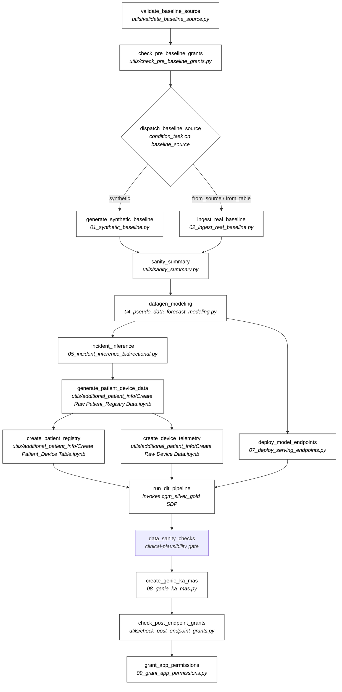

# Repository navigation guide

> **Audience**: new contributors / operators trying to figure out which files do what, and how the pipeline is wired.

For deployment steps see [`DEPLOY.md`](DEPLOY.md). For project overview see [`README.md`](README.md). For dated change + decision history see [`CHANGELOG.md`](CHANGELOG.md) — it is the canonical record of every notable discovery.

## At a glance

Glucosphere is a Databricks Asset Bundle (DAB)–deployed CGM intelligence demo. On `databricks bundle deploy`, the bundle provisions:

- a **SDP (Spark Declarative Pipeline)** for bronze → silver → gold CGM tables
- a **multi-stage workflow job** (`glucosphere_full_setup`) that runs ingest → forecast modeling → incident inference → endpoint deploy → agent setup → grant chain
- a **Databricks App** (Flask backend + React frontend)
- a **Lakebase OLTP** instance, **SQL warehouse**, and **ML serving endpoints**
- optional **MAS / KA / Genie** agent endpoints + AI/BI dashboards

The entire deployable surface is described by a single file: [`databricks.yml`](databricks.yml).

---

## I want to…

### …deploy this to a new workspace

| Read | What it does |
|---|---|
| [`DEPLOY.md`](DEPLOY.md) | step-by-step first-time deploy guide with troubleshooting |
| [`.env.bundle.example`](.env.bundle.example) | template you `cp` to local `.env.bundle` (operator-owned) and fill in 3 tokens |
| [`databricks.yml`](databricks.yml) | the bundle definition — `targets`, `variables`, `resources` (all of them) |
| [`scripts/render_app_yaml.py`](scripts/render_app_yaml.py) | rewrites `App/databricks/app.yaml` per target (discovers bundle-managed warehouse by name) |
| [`scripts/smoke_test.py`](scripts/smoke_test.py) | pre-PR automated smoke test — 8 checks covering App state + URL + warehouse + gold table data + KA/MAS endpoints + Genie space + firmware-variety + MetricsExplained UC-asset PNG |

Quick deploy sequence (after `source .env.bundle`):

```bash
databricks bundle deploy -t <target>                       # pass 1 — creates warehouse
uv run python scripts/render_app_yaml.py --target <target> # writes WAREHOUSE_ID into app.yaml
databricks bundle deploy -t <target>                       # pass 2 — picks up rendered app.yaml
databricks bundle run glucosphere_full_setup -t <target>   # ~45 min pipeline (creates KA/MAS/Genie)
# (re-render app.yaml with --mas-endpoint/--ka-endpoint/--genie-space-id from job logs + redeploy — first-deploy-only)
databricks bundle run glucosphere_app -t <target>          # deploy App source + start compute
uv run python scripts/smoke_test.py --target <target> --profile <profile>  # 8-check automated gate
```

See [`DEPLOY.md`](DEPLOY.md) for the canonical step-by-step.

### …understand the data + modeling pipeline

The numbered notebooks in [`Data_DataGen_ModelForecast/`](Data_DataGen_ModelForecast/) implement the workflow stages. The `glucosphere_full_setup` job orchestrates them via a condition_task that dispatches on `baseline_source` (`synthetic` / `from_source` / `from_table`).

| File | Role |
|---|---|
| [`01_synthetic_baseline.py`](Data_DataGen_ModelForecast/01_synthetic_baseline.py) | inline synthetic CGM generator — used by `baseline_source=synthetic` |
| [`02_ingest_real_baseline.py`](Data_DataGen_ModelForecast/02_ingest_real_baseline.py) | downloads HUPA-UCM real CGM dataset — used by `from_source` |
| [`03_compare_baseline_modes.py`](Data_DataGen_ModelForecast/03_compare_baseline_modes.py) | side-by-side baseline-mode statistical comparison (not in main DAG; runs via the standalone `glucosphere_distribution_comparison` job) |
| [`04_pseudo_data_forecast_modeling.py`](Data_DataGen_ModelForecast/04_pseudo_data_forecast_modeling.py) | XGBoost forecast model training (15-min + 30-min horizons) — writes to UC Models |
| [`05_incident_inference_bidirectional.py`](Data_DataGen_ModelForecast/05_incident_inference_bidirectional.py) | **active** incident-simulation notebook — two-incident mirror, bidirectional cohort split |
| [`06_incident_inference_single.py`](Data_DataGen_ModelForecast/06_incident_inference_single.py) | **reference-only** sibling — unidirectional single-incident variant. Not wired into the main DAG; swap `databricks.yml` `incident_inference.notebook_path` to use it. |
| [`07_deploy_serving_endpoints.py`](Data_DataGen_ModelForecast/07_deploy_serving_endpoints.py) | promotes UC Models to serving endpoints |
| [`08_genie_ka_mas.py`](Data_DataGen_ModelForecast/08_genie_ka_mas.py) | provisions MAS / KA / Genie agent endpoints |
| [`09_grant_app_permissions.py`](Data_DataGen_ModelForecast/09_grant_app_permissions.py) | grants warehouse + UC + endpoint perms to the App SP |
| [`utils/validate_baseline_source.py`](Data_DataGen_ModelForecast/utils/validate_baseline_source.py) | first job task — enum validation + provenance row write |
| [`utils/check_pre_baseline_grants.py`](Data_DataGen_ModelForecast/utils/check_pre_baseline_grants.py) | precondition grant verification before ingest |
| [`utils/sanity_summary.py`](Data_DataGen_ModelForecast/utils/sanity_summary.py) | post-ingest summary metrics |
| [`utils/check_post_endpoint_grants.py`](Data_DataGen_ModelForecast/utils/check_post_endpoint_grants.py) | post-deploy grant verification on endpoints |
| [`utils/validate_diabetes_data.py`](Data_DataGen_ModelForecast/utils/validate_diabetes_data.py) | data-quality assertions (used by sanity_summary + standalone) |
| [`utils/additional_patient_info/transformations.sql`](Data_DataGen_ModelForecast/utils/additional_patient_info/transformations.sql) | **SDP / DLT pipeline source** — bronze → silver → gold transforms for `cgm_silver_gold` pipeline |
| [`utils/additional_patient_info/Create *.ipynb`](Data_DataGen_ModelForecast/utils/additional_patient_info/) | 3 setup notebooks: patient registry, raw device data, patient-device link table |
| [`configs/baseline_config.yaml`](Data_DataGen_ModelForecast/configs/baseline_config.yaml) | pipeline hyperparameters (per-env: dev / staging / prod) |

For deeper detail: [`Data_DataGen_ModelForecast/README.md`](Data_DataGen_ModelForecast/README.md) (pipeline guide) and [`Data_DataGen_ModelForecast/README_data.md`](Data_DataGen_ModelForecast/README_data.md) (table schemas).

### …modify the App (frontend or backend)

| Path | Stack | What it does |
|---|---|---|
| [`App/src/`](App/src/) | React (Vite) | frontend root — `App.jsx`, `main.jsx`, `index.css`, `ErrorBoundary.jsx` |
| [`App/src/pages/GlucoseLandingDashboard.jsx`](App/src/pages/GlucoseLandingDashboard.jsx) | React | landing page ("Glucosphere") |
| [`App/src/pages/DiabetesCoachDashboard.jsx`](App/src/pages/DiabetesCoachDashboard.jsx) | React | patient-facing coach dashboard |
| [`App/src/pages/CareManagementDashboard.jsx`](App/src/pages/CareManagementDashboard.jsx) | React | clinician dashboard |
| [`App/src/pages/DeviceSupportDashboard.jsx`](App/src/pages/DeviceSupportDashboard.jsx) | React | device-team dashboard |
| [`App/src/pages/MetricsExplained.jsx`](App/src/pages/MetricsExplained.jsx) | React | metrics + simulation framing prose |
| [`App/src/components/AgentChatInterface.jsx`](App/src/components/AgentChatInterface.jsx) | React | MAS / KA / Genie chat UI |
| [`App/src/components/IncidentCharts.jsx`](App/src/components/IncidentCharts.jsx) | React | MAE timeline + incident-impact charts |
| [`App/src/api/`](App/src/api/) | JS | API client (Flask + Statement Execution + agent endpoints) |
| [`App/databricks/app.py`](App/databricks/app.py) | Flask (Python) | backend — proxies SQL via Statement Execution API, MAS / KA / Genie via serving endpoints, provenance lookup |
| [`App/databricks/app.yaml`](App/databricks/app.yaml) | YAML | env vars + resource bindings (**auto-rewritten** by `scripts/render_app_yaml.py`) |
| [`App/databricks/static/`](App/databricks/static/) | static | Vite build output (committed) |
| [`App/run_backend.sh`](App/run_backend.sh) | Bash | local dev launcher |
| [`App/README.md`](App/README.md) | docs | App dev setup |

### …understand the architecture or history

| Resource | Use it when |
|---|---|
| [`README.md`](README.md) | first read — overview, baseline modes, sequencing |
| [`Data_DataGen_ModelForecast/assets/architecture.png`](Data_DataGen_ModelForecast/assets/architecture.png) | system architecture diagram — Lakehouse + Lakeflow + Lakebase + UC + Vector Search + LLM/Agent + Genie + App + AI/BI dashboards |
| [`CHANGELOG.md`](CHANGELOG.md) | dated record of every notable change + discovery. **Read this first** when asking "why did we do X?" or "what gotcha was already caught?" |
| [`Data_DataGen_ModelForecast/README.md`](Data_DataGen_ModelForecast/README.md) | pipeline + modeling guide, methodology references |

---

## Workflow DAG — `glucosphere_full_setup`

17 tasks defined in [`databricks.yml`](databricks.yml) `resources.jobs.glucosphere_full_setup.tasks`. Branching at `dispatch_baseline_source` (condition_task on `baseline_source`); merge at `sanity_summary`; fan-out from `datagen_modeling`; converge again at `run_dlt_pipeline`; clinical-plausibility gate (`data_sanity_checks`) before `create_genie_ka_mas`.



Standalone job (not part of `glucosphere_full_setup`): `glucosphere_distribution_comparison` runs `03_compare_baseline_modes.py` for side-by-side baseline statistical comparison.

---

## By-category file inventory (PR-shipped)

### Deployment glue

- `databricks.yml` — bundle definition (targets, variables, resources)
- `.env.bundle.example` — template for operator's local `.env.bundle`
- `scripts/render_app_yaml.py` — per-target App config rewriter
- `DEPLOY.md` — deploy guide

### SDP / DLT pipeline source

- `databricks.yml` → `resources.pipelines.cgm_silver_gold` — pipeline resource declaration
- `Data_DataGen_ModelForecast/utils/additional_patient_info/transformations.sql` — actual silver/gold transforms

### Workflow job orchestration

- `databricks.yml` → `resources.jobs.glucosphere_full_setup` — main DAG (17 tasks, see Mermaid above)
- `databricks.yml` → `resources.jobs.glucosphere_distribution_comparison` — standalone baseline-comparison job
- `Data_DataGen_ModelForecast/01_*` through `09_*` + `utils/*.py` — task implementation notebooks

### App resources

- All of `App/` (React + Flask backend + config + committed Vite build output)
- `databricks.yml` → `resources.apps.glucosphere_app` + `sql_warehouses.glucosphere_warehouse` (the `database_instances.glucosphere_oltp` Lakebase block is currently commented out — re-enabled when the Lakebase path lands per issue #3)

### Configuration & assets

- `Data_DataGen_ModelForecast/configs/baseline_config.yaml` — pipeline hyperparameters
- `Data_DataGen_ModelForecast/assets/architecture.png` — system architecture diagram
- `Data_DataGen_ModelForecast/assets/*.png` — plot exports surfaced in dashboards or docs
- `Data_DataGen_ModelForecast/assets/who_docs/WHO_NCD_NCS_99.2.pdf` — knowledge base for the **Knowledge Assistant (KA) endpoint**. `08_genie_ka_mas.py` copies this PDF into UC Volume `pipeline_data/who_docs/` (shared pipeline_data — same UC Volume that holds raw_patient_registry/, raw_device_telemetry_stream/, and incident_inference_assets/) and creates a KA via `/api/2.0/knowledge-assistants` that does RAG over it. The MAS (Multi-Agent Supervisor) endpoint routes the App's clinical-guidance natural-language queries to this KA; SQL / structured-data queries go to Genie instead.

### Auto-generated, per-target rendered

- `App/databricks/app.yaml` — rewritten by `scripts/render_app_yaml.py` per target. Pinned to whichever target was last rendered. Switch targets ⇒ re-render before deploy.
- `App/databricks/static/` — Vite build output. Re-build via `npm run build` in `App/`.

---

## What's gitignored / never PR-shipped

Anything not in git is invisible to PRs — it lives only on the operator's filesystem. The full list of ignored patterns is in [`.gitignore`](.gitignore); the load-bearing ones for new operators:

- **`.env.bundle`** — your per-workspace config (catalog / schema / profile). You create it from `.env.bundle.example`. Never committed.
- **`ref_notes/`** — your local scratchpad for session notes, design drafts, test scripts, internal explainers. When a doc matures into something team-shareable, promote it (`git mv ref_notes/<file>.md docs/<file>.md` on a docs branch).
- **Credentials** (`.databrickscfg`, `*.token`, `.env*`, `config/databricks_config*.json`, `.npmrc`, `.pip/pip.conf`) — never commit. The `.gitignore` covers these as a safety net.
- **Build artifacts** (`App/node_modules/`, `__pycache__/`, `dist/`, `.vite/`, `*.pyc`, `.pytest_cache/`, etc.) — regenerate locally.
- **Editor / IDE state** (`.vscode/`, `.idea/`, `.claude/`, `.cursor/`, `.DS_Store`) — operator-specific.
- **`resume/`, `previous/`, `_dev/`, `.devs/`, `.refs/`** — local sandbox / staging paths.

If you need historical context on a specific design decision or gotcha, [`CHANGELOG.md`](CHANGELOG.md) is the canonical record.

---

## See also

- [`README.md`](README.md) — project overview
- [`DEPLOY.md`](DEPLOY.md) — deployment guide
- [`CHANGELOG.md`](CHANGELOG.md) — dated change + discovery history (the canonical "why" record)
- [`Data_DataGen_ModelForecast/README.md`](Data_DataGen_ModelForecast/README.md) — pipeline + modeling guide
- [`Data_DataGen_ModelForecast/README_data.md`](Data_DataGen_ModelForecast/README_data.md) — curated table schemas
- [`App/README.md`](App/README.md) — App dev setup
